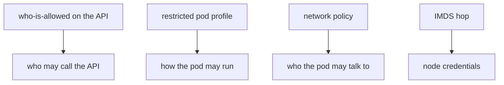
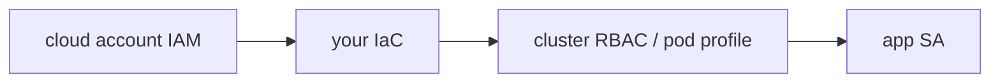

# Workload identity vs namespace privacy

**Kind:** design-exercise
**Loop step:** 2 Model

## Could someone else name the admission check from your cluster map?

"We put it in its own namespace" is not this lesson. A drawing someone else can test names **ServiceAccount, Role vs ClusterRole, pod-profile level, whether the pod can reach instance metadata, and who can apply Helm**.

This week on the notes app: local `pod_ok(role)`. No live kube-apiserver.

> For admission, the rule is deny when the role is `cluster-admin`. A namespaced app role may run. Evidence that the deny is false: `pod_ok("cluster-admin")` returns true.

If the role × namespace row is blank, the pod runs because nobody named the check.

## Picture: four planes

## Picture: shared responsibility

The cloud's hypervisor is not your ClusterRoleBinding.

## Step 1: name the pieces

Take the cluster you already have and ask what would show cluster-admin is still allowed.

| Piece | This system |
|---|---|
| Who | Compromised app container; malicious chart |
| What | API server; instance metadata |
| Actions | `pod_ok` |
| Paths | Who-is-allowed on the API; pod admission; metadata hop |
| What you trust for this journey | Allow-listed namespaced role |
| What you do not trust | Dockerfile USER; hostNetwork; Helm convenience ClusterRoles |
| Time | Deploy; chart upgrade |
| The rule | Authorization of the control plane |

## Step 2: write allow and deny

| Who | What | Action | Decision |
|---|---|---|---|
| app SA | namespace Role | run | may allow |
| app SA | cluster-admin | run | deny |
| app pod | instance metadata | GET | deny-or-hop |
| break-glass | ClusterRole | use | later elective, timeboxed |

A private namespace with `pod_ok` always true is how "we isolated it" becomes cluster-admin. Write the hole.

## Practice

Open `iam.py` in `labs/10.3/10.3-lab`.

## Use it somewhere new

Serverless IAM `*` is the same rule with different syntax.

## What can still go wrong

Break-glass admin with a later elective. Documented connection and retry toward the API server is extra, advanced work.

## What this page is not doing

Answer keys are not on this site.
