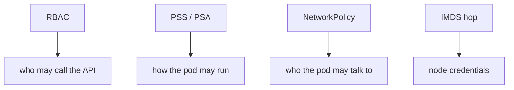
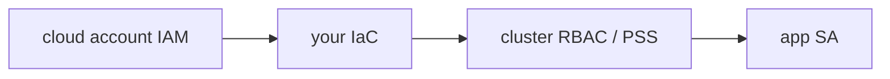

# 10.3-LO-02 — Workload identity vs namespace privacy

**Kind:** design-exercise
**Loop step:** 2 Model
**Standards:** ASVS `v5.0.0-13.2.1`, `v5.0.0-13.2.2`, `v5.0.0-13.2.4`. Kubernetes PSS. NIST SP 800-190.

## Can a second engineer name the admission check from your cluster map?

“We put it in its own namespace” is not this lesson. A reviewable model names **ServiceAccount, Role vs ClusterRole, PSS level, IMDS reachability, and who can apply Helm**.

SecureCollab freeze: local `pod_ok(role)`. No live kube-apiserver.

## Mental model: four planes

## Mental model: shared responsibility

The cloud’s hypervisor is not your ClusterRoleBinding.

## Step 1: freeze pieces

| Piece | This system |
|---|---|
| Subjects | compromised app container; malicious chart |
| Objects | API server; IMDS |
| Actions | `pod_ok` |
| Channels | RBAC; PSA; metadata (6.5) |
| TCB | allowlisted namespaced role |
| Untrusted | Dockerfile USER; hostNetwork; Helm convenience ClusterRoles |
| State / time | deploy; chart upgrade |
| 1.1 cell | authorization of the control plane |

## Step 2: write cells

| Subject | Object | Action | Decision |
|---|---|---|---|
| app SA | namespace Role | run | may allow |
| app SA | cluster-admin | run | deny |
| app pod | IMDS | GET | deny-or-hop |
| break-glass | ClusterRole | use | E6 timebox |

## Practice

Draw the map. Point at `labs/10.3/10.3-lab` file `iam.py`.

## Transfer

Serverless IAM `*` is the same cell with different syntax.

## Residual risk

Break-glass admin with E6; `v5.0.0-13.2.6` Level 3 connection/retry toward the API server.

## Non-goals

Top 10 as the definition of security. Keys stay out of lessons.
