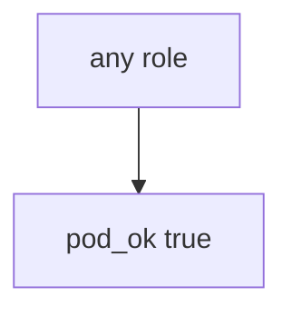

# 10.3-LO-03 — Observe always-true pod_ok, do not attack clusters

**Kind:** mechanism-lab
**Loop step:** 3 Break
**Standards:** OWASP ASVS 5.0.0 (final) `v5.0.0-13.2.1`. `v5.0.0-13.2.6` documented cluster-API retry is **Level 3, advanced**. NIST SP 800-190 (final, 2017) as stack vocabulary. Kubernetes PSS/PSA as pod-hardening vocabulary. Lab policy: local only.

## Authorized scope

`labs/10.3/10.3-lab` only. The fixture is an in-process `pod_ok(role)`. Synthetic role strings `cluster-admin` / `app`. Do **not** apply ClusterRoleBindings to a real cluster, cloud account, or shared lab Kubernetes as the exercise.

**Forbidden outcome:** App pod granted cluster-admin. `pod_ok("cluster-admin")` returns true.

Attacker capability in this lab: a compromised container or a malicious Helm chart. That stands in for “the API namespace is private so ClusterRole is fine,” a CIS Kubernetes scan treated as 1.2, or NetworkPolicy treated as RBAC. Trust assumption: `pod_ok` is supposed to allow **only namespaced app roles**. EKS defaults, PSS `restricted`, NetworkPolicy, and FastAPI itself are not in the TCB for this cell.

## Mental model: admission always says yes



The vulnerable tree demonstrates **cause** (god-mode for convenience). Do not probe public APIs. Preconditions: `pod_ok` returns true for every role. You do not need kube-apiserver. You must not bind a live cluster.

ASVS `v5.0.0-13.2.1` wants individual backend service accounts, not a shared god role. Module 3.3 already said DB god-mode is a blast-radius cell; this cell is **3.3 at cluster grain**. Gate 10 and M4 stay **not-attempted**.

## What to read in the fixture

`vulnerable/iam.py` returns true for every role. Tests:

- `test_cluster_admin_pod_is_denied`
- `test_namespaced_app_role_may_run` — `"app"` may pass on both

You do not need a new role string. The failure of `test_cluster_admin_pod_is_denied` *is* the evidence.

Do not open the fixed tree yet. Diagnose the cause first.

## Root cause vs impact vs prevention vs detection vs recovery

| Slice | This lab |
|---|---|
| Required property | `pod_ok("cluster-admin")` is false |
| Root cause | Always-true admission; god-mode for convenience |
| Preconditions | `pod_ok` true for every role |
| Trigger | Compromised container or malicious chart |
| Impact | One app bug becomes control-plane takeover |
| Prevention | Allowlist namespaced roles; unknown roles deny |
| Detection | `cluster_admin_denied`; never kubeconfig |
| Recovery | Delete the binding; rotate cluster credentials |
| Not the lesson | A CIS score; live EKS; Gate 10 complete |

## Framework defaults versus the admission guarantee

Managed Kubernetes is not least privilege. PSS `restricted` hardens the *pod spec*; it does not replace RBAC. FastAPI will still run as whatever SA the chart mounts. The application guarantee is: **this** fixture, `cluster-admin` is deny.

## Practice

```text
python3 -m pytest labs/10.3/10.3-lab/tests --impl vulnerable
```

Run from `labs/10.3/10.3-lab` if a repo-root collection picks up `site/`. Record `test_cluster_admin_pod_is_denied`. Do not probe public hosts. An environment error is not security evidence.

## Transfer

Clinic app SA is cluster-admin: predict without leaving this directory. Do not apply YAML to a live cluster.

## Non-goals

No live-cluster, cloud-account, or public Kubernetes API instructions. Do not claim Gate 10 or M4. Do not fetch instance metadata as an exercise.
