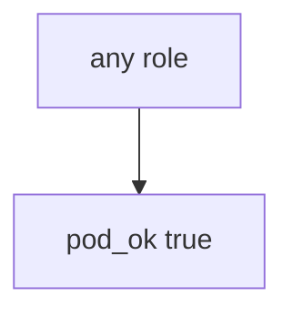

# Practice: always-true pod_ok

**Kind:** mechanism-lab
**Loop step:** 3 Break

## Try it

The practice is not a cluster you attack. `pod_ok` returns true for every role: it never looks at the role, so any role already gets in.

> An app pod must not run as cluster-admin. If `pod_ok("cluster-admin")` returns true, admission has failed as a security control.

## Where you may practice

Stay inside `labs/10.3/10.3-lab`. The roles are synthetic strings `cluster-admin` / `app`. Do **not** apply ClusterRoleBindings to a real cluster, cloud account, or shared lab Kubernetes as the exercise.

Do not paste this exercise onto a public cluster, employer account, or live hospital Kubernetes "to see what happens."

`pod_ok` is supposed to allow **only namespaced app roles** — not Managed-cluster defaults, a restricted pod profile, a network policy, or FastAPI itself.

Picture a compromised container or a malicious Helm chart — "the API namespace is private so ClusterRole is fine," a CIS Kubernetes scan treated as the who-is-allowed check, or a network policy treated as RBAC.

## Picture: admission always says yes



You do not need a kube-apiserver. You must not bind a live cluster. The true return for `"cluster-admin"` is already the leak.

The database god-role lesson already said one shared admin is a blast-radius rule. This check is **the same idea at cluster grain**.

## What to look at: the cause, not a hunt

`vulnerable/iam.py` returns true for every role. Tests:

- `test_cluster_admin_pod_is_denied`
- `test_namespaced_app_role_may_run` — `"app"` may pass on both


| What you see | What kind of failure | Not the lesson |
|---|---|---|
| `return True` for every role | Always-true admission; god-mode for convenience | "The namespace is private" |
| `"cluster-admin"` still runs | What must not happen is allowed | A CIS score |
| No look at `"app"` membership | The gate accepted a god role | A network policy |

## Why it happens vs what it costs

| Slice | Practice |
|---|---|
| The rule | `pod_ok("cluster-admin")` is false |
| Why it happens | Always-true admission; god-mode for convenience |
| What's already wrong | `pod_ok` true for every role |
| Trigger | Compromised container or malicious chart |
| What it costs | One app bug becomes control-plane takeover |
| How you stop it later | Allow-list namespaced roles; unknown roles deny |
| How you notice later | `cluster_admin_denied`; never kubeconfig |
| How you recover later | Delete the binding; rotate cluster credentials |
| Out of scope | A CIS score; a live managed cluster; treating this cluster lesson as a check-in |

A managed cluster will still accept a ClusterRoleBinding. A restricted pod profile hardens the *pod spec*. FastAPI will still run as whatever SA the chart mounts. The notes app's API will still take the cluster if admission is always true. `cluster-admin` is deny.

## Practice

```text
python3 -m pytest labs/10.3/10.3-lab/tests --impl vulnerable
```

Run from `labs/10.3/10.3-lab` if a collection at the repo root picks up `site/`. Do not probe public hosts. A setup error is not proof the rule holds.

## Use it somewhere new

An app service account that is cluster-admin is the same god-mode. Predict without leaving this directory. Do not apply manifests to a live cluster.

## What this page is not doing

No live-cluster, cloud-account, or public Kubernetes API instructions. This page does not mark you as finished. Do not fetch instance metadata as an exercise.
