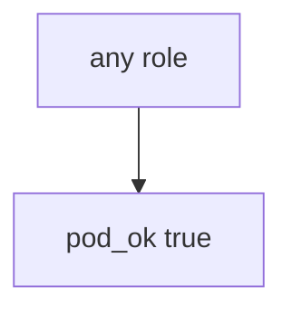

# 10.3-LO-03 — Observe always-true pod_ok, do not attack clusters

**Kind:** mechanism-lab
**Loop step:** 3 Break
**Standards:** ASVS `v5.0.0-13.2.1`. Lab policy: local only.

## Authorized scope

`labs/10.3/10.3-lab` only. Synthetic role strings `cluster-admin` / `app`. Do **not** apply ClusterRoleBindings to a real cluster, cloud account, or shared lab Kubernetes as the exercise.

**Forbidden outcome:** App pod granted cluster-admin.

## Mental model: admission always says yes



The vulnerable tree demonstrates **cause** (god-mode for convenience). Do not probe public APIs.

## What to read in the fixture

`vulnerable/iam.py` returns true for every role. Tests require `pod_ok("cluster-admin")` to be false.

## Root cause vs impact

| Slice | Lab |
|---|---|
| Root cause | Always-true admission |
| Impact | Control-plane takeover from one app bug |
| Not the lesson | A CIS Kubernetes product score as the definition |

## Practice

```
python3 -m pytest labs/10.3/10.3-lab/tests --impl vulnerable
```

Record `test_cluster_admin_pod_is_denied`. Do not probe public hosts.

## Transfer

Clinic app SA is cluster-admin: predict without leaving this directory.

## Non-goals

No live-cluster, cloud-account, or public Kubernetes API instructions.
