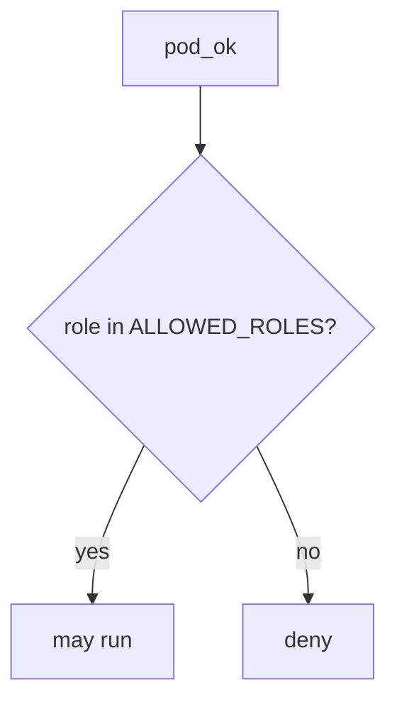

# 10.3-LO-04 — Allowlist namespaced app roles

**Kind:** design-exercise
**Loop step:** 4 Build
**Standards:** ASVS 5.0.0 (final) `v5.0.0-13.2.1`, `v5.0.0-13.2.2`. Kubernetes PSS as extra, not the predicate. `v5.0.0-13.2.6` is **Level 3, advanced**. NIST SP 800-190 as vocabulary.

## Structural means admission compares to an allowlist

`pod_ok` must return `role in ALLOWED_ROLES` where `ALLOWED_ROLES` is `{"app"}`. Fail-safe: unknown roles deny. A denylist of the string `cluster-admin` would still be god-mode-minus-one-name. Structural means that membership — not namespace name, not NetworkPolicy, not a CIS score.

The lab allowlist is a **stand-in** for a namespaced Role + RoleBinding plus PSA `restricted`. It is not kube-apiserver. The smallest restore for SecureCollab’s API SA is: `cluster-admin` → do not run.

## Mental model: namespace is not cluster-admin



Do not accept “it is in namespace sc-prod” as membership. Production still needs the allowlist to be the *right* Role — `"app"` that can still list all Secrets is a lying least-privilege. PSS `restricted` remains a sibling grain. `v5.0.0-13.2.4` outbound allowlist (IMDS hop, 6.5) is not this pytest. `v5.0.0-13.2.6` (documented connection/retry toward the cluster API) is Level 3 advanced.

ASVS `v5.0.0-13.2.2` wants those accounts least-privileged. This pytest is that sentence for cluster-admin.

## Why this restores the cell

| After the fix | Must be true |
|---|---|
| cluster-admin | run false |
| app | run true |

## What this is not

NetworkPolicy. PSS profile alone. EKS IRSA sticker. Gate 10 / M4. Break-glass (residual, E6). FastAPI defaults. A CIS benchmark.

## Mechanism limits

- `"app"` that can still patch Deployments is a lying allowlist.
- Break-glass ClusterRole remains E6, not this predicate.
- IMDS hop (6.5) can leak node IAM even with a good Role.
- Helm chart supply chain is 10.2.
- Leftover user session on a worker is 7.4.

## Practice

Name who can apply Helm ClusterRoles. Run:

```text
python3 -m pytest labs/10.3/10.3-lab/tests --impl fixed
```

Must pass. Run from the lab directory if collection at repo root is polluted.

## Transfer

Serverless: replace `ALLOWED_ROLES` with an IAM statement that is not `*`. Same allowlist idea, different object.

## Residual risk

Break-glass ClusterRole; IMDS hop (6.5); `v5.0.0-13.2.6` Level 3; leftover user session on a worker (7.4).

## Non-goals

Do not apply YAML to a live cluster. Do not claim Gate 10 from a CIS screenshot. Do not present PSS as RBAC.
