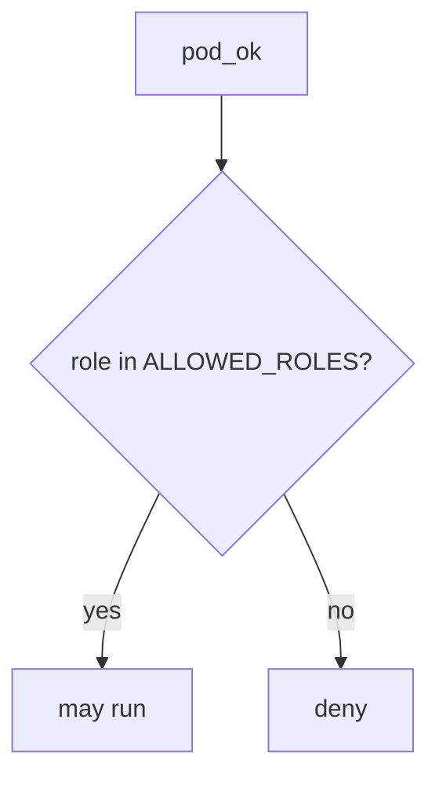

# 10.3-LO-04 — Allowlist namespaced app roles

**Kind:** design-exercise
**Loop step:** 4 Build
**Standards:** ASVS 5.0.0 (final) `v5.0.0-13.2.1`, `v5.0.0-13.2.2`. Kubernetes PSS as extra, not the predicate.

## Structural means admission compares to an allowlist

`pod_ok` must return `role in ALLOWED_ROLES` where `ALLOWED_ROLES` is `{"app"}`. Fail-safe: unknown roles deny. A denylist of the string `cluster-admin` would still be god-mode-minus-one-name.

The lab allowlist is a **stand-in** for a namespaced Role + RoleBinding plus PSA `restricted`. It is not kube-apiserver.

## Mental model: allowlist gate



Do not accept “it is in namespace sc-prod” as membership.

## Why this restores the cell

| After the fix | Must be true |
|---|---|
| cluster-admin | run false |
| app | run true |

## What this is not

NetworkPolicy. PSS profile alone. EKS IRSA sticker. Gate 10 / M4. Break-glass (residual, E6).

## Practice

Name who can apply Helm ClusterRoles. Run:

```
python3 -m pytest labs/10.3/10.3-lab/tests --impl fixed
```

Must pass.

## Transfer

Serverless: replace `ALLOWED_ROLES` with an IAM statement that is not `*`.

## Residual risk

Break-glass ClusterRole; IMDS hop (6.5); `v5.0.0-13.2.6` Level 3; leftover user session on a worker (7.4).
