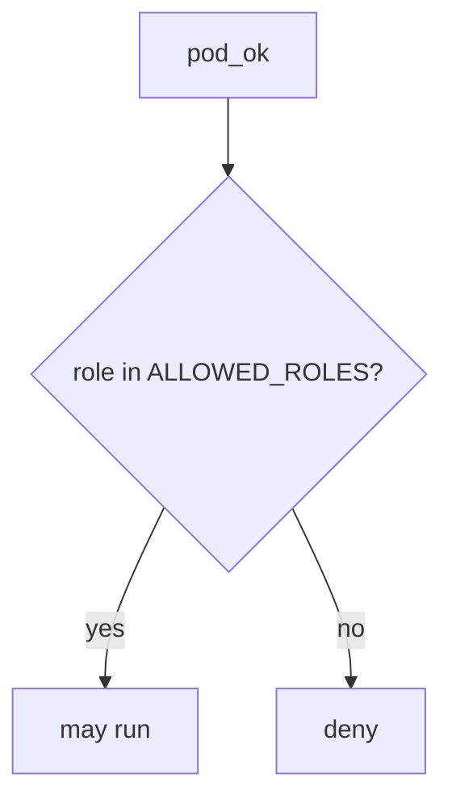

# Allow-list namespaced app roles

**Kind:** design-exercise
**Loop step:** 4 Build

## The rule

A private namespace does not deny `cluster-admin`. A network policy is a different cut. A green CIS scan is a score, not `pod_ok`.

Do this: `pod_ok` **returns `role in ALLOWED_ROLES`** where `ALLOWED_ROLES` is `{"app"}`. Unknown roles deny. A denylist of the string `cluster-admin` would still be god-mode-minus-one-name. Read it as that membership — not namespace name, not a network policy, not a CIS score.

The lab allow-list is a **stand-in** for a namespaced Role plus RoleBinding plus a restricted pod profile. It is not kube-apiserver. The notes app's API SA needs this: `cluster-admin` → do not run. If you are unsure whether the role is namespaced, deny. Sitting in namespace sc-prod does not make cluster-admin an app role.

## Picture: namespace is not cluster-admin



The pod Role has to sit in `{"app"}`. An `"app"` Role that can still list all Secrets is lying least-privilege. A restricted pod profile remains a sibling grain. An outbound allow-list (the metadata hop) does not deny cluster-admin. Documented connection and retry toward the cluster API is extra, advanced work.

Those accounts should be least-privileged — cluster-admin.

## What the repaired files must show

Do not treat `fixed/iam.py` as a production cluster product.

| After the fix | Must be true |
|---|---|
| cluster-admin | run false |
| app | run true |

By default, if you are unsure whether the role is a namespaced app role, deny. A private-looking namespace does not make it a run.

## What this is not

- A network policy.
- A restricted pod profile alone.
- A managed-cluster identity sticker.
- A CIS score treated as done.
- Break-glass (leftover, later elective).
- FastAPI defaults as the pod Role.
- A CIS benchmark.

## What the tool cannot do

- `"app"` that can still patch Deployments is a lying allow-list.
- Break-glass ClusterRole remains a later elective, not this predicate.
- The metadata hop can leak node credentials even with a good Role.
- Helm chart supply chain is the previous module.
- Leftover user session on a worker is the worker-identity lesson.

## Practice

Name who can apply Helm ClusterRoles. Run:

```text
python3 -m pytest labs/10.3/10.3-lab/tests --impl fixed
```

## Use it somewhere new

Serverless: replace `ALLOWED_ROLES` with an IAM statement that is not `*`. Same allow-list idea, different object.

## What can still go wrong

Break-glass ClusterRole. The metadata hop. Documented cluster-API retry (extra, advanced). Leftover user session on a worker.

## What this page is not doing

Do not apply manifests to a live cluster. This page does not mark you as finished. A CIS screenshot is not a check-in. Do not present a restricted pod profile as who-is-allowed on the API.
