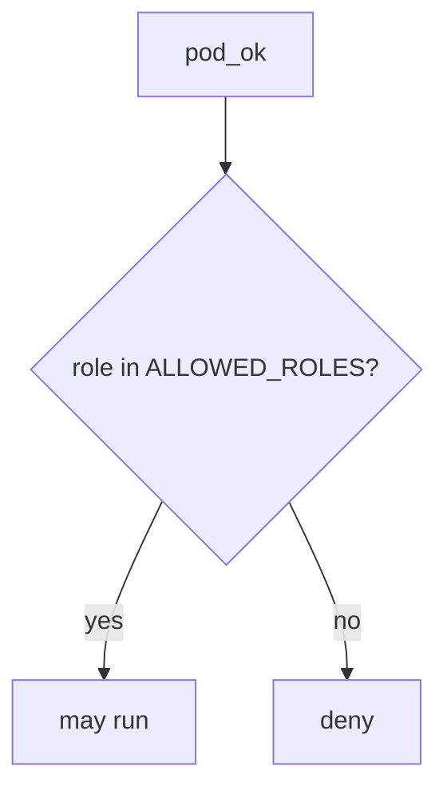

# Allow-list namespaced app roles

**Kind:** design-exercise
**Loop step:** 4 Build

## The rule

A private namespace is not the fix. A network policy is not the fix. "The CIS scan is green so we shipped it" is not the fix.

The structural change is: `pod_ok` **returns `role in ALLOWED_ROLES`** where `ALLOWED_ROLES` is `{"app"}`. Fail-safe: unknown roles deny. A denylist of the string `cluster-admin` would still be god-mode-minus-one-name. Structural means that membership — not namespace name, not a network policy, not a CIS score.

The lab allow-list is a **stand-in** for a namespaced Role plus RoleBinding plus a restricted pod profile. It is not kube-apiserver. The smallest restore for the notes app's API SA is: `cluster-admin` → do not run. Fail-safe: if you are unsure whether the role is namespaced, deny. Do not fail open because "it is in namespace sc-prod."

## Picture: namespace is not cluster-admin



The repaired files require membership in `{"app"}`. Production still needs that allow-list to be the *right* Role — `"app"` that can still list all Secrets is a lying least-privilege. A restricted pod profile remains a sibling grain. An outbound allow-list (the metadata hop) is not this check. Documented connection and retry toward the cluster API is extra, advanced work.

Those accounts should be least-privileged. This week's check covers cluster-admin.

## What the repaired files must show

Read `fixed/iam.py` against this checklist. Do not treat the snippet as a production cluster product.

| After the fix | Must be true |
|---|---|
| cluster-admin | run false |
| app | run true |

Fail closed: if you are unsure whether the role is a namespaced app role, deny. Uncertainty is a **no** on run, not a yes because the namespace looks private.

## What this is not

- A network policy.
- A restricted pod profile alone.
- A managed-cluster identity sticker.
- An assurance gate sticker.
- Break-glass (leftover, later elective).
- FastAPI defaults.
- A CIS benchmark.

## What the tool cannot do

- `"app"` that can still patch Deployments is a lying allow-list.
- Break-glass ClusterRole remains a later elective, not this predicate.
- The metadata hop can leak node credentials even with a good Role.
- Helm chart supply chain is the previous module.
- Leftover user session on a worker is the worker-identity lesson.

## Practice

Name who can apply Helm ClusterRoles. Run:

```text
python3 -m pytest labs/10.3/10.3-lab/tests --impl fixed
```

## Use it somewhere new

Serverless: replace `ALLOWED_ROLES` with an IAM statement that is not `*`. Same allow-list idea, different object.

## What can still go wrong

Break-glass ClusterRole. The metadata hop. Documented cluster-API retry (extra, advanced). Leftover user session on a worker.

## What this page is not doing

Do not apply manifests to a live cluster. This page does not mark you as finished. from a CIS screenshot. Do not present a restricted pod profile as who-is-allowed on the API.
