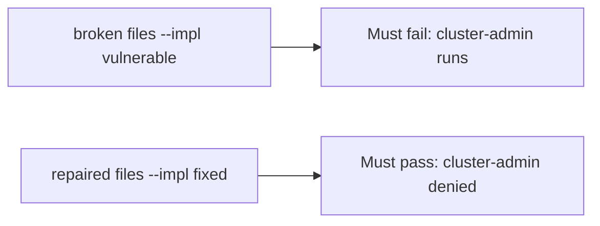

# A broken admission must fail the check

**Kind:** verification-lab
**Loop step:** 5 Verify

## Check it

Running Kubernetes does not deny `cluster-admin`. A green CIS scan is a score. `pod_ok("cluster-admin")` has to be false, and `"app"` may run. On the broken helper, cluster-admin still runs. Repair refuses `cluster-admin`. Do not apply manifests to a live cluster.

## Picture: a broken admission must fail the check

`pod_ok("cluster-admin")` can still return true while the rest of the suite looks fine.



If the broken admission still passes, cluster-admin was never the case under test.

## What the check has to show

| Mode | Must show for this topic |
|---|---|
| Normal | `app` → may run (may pass on both) |
| Wrong input | cluster-admin → cannot run; broken files must fail |
| Abuse | Unknown roles still deny (fail closed) |
| Not claimed | A live managed cluster; a CIS score; a check-in; that `"app"` is least privilege |

`test_cluster_admin_pod_is_denied` catches a `pod_ok` that never returns false.

A pod using `"app"` may pass on both sides. You still have to deny cluster-admin. If the broken files do not fail `test_cluster_admin_pod_is_denied`, the lab is miswired — fix the wiring, not the assertion.

```text
python3 -m pytest labs/10.3/10.3-lab/tests --impl vulnerable
python3 -m pytest labs/10.3/10.3-lab/tests --impl fixed
```

A `namespace:` line in a chart is not `pod_ok("cluster-admin")`. This practice never opens a live cluster.

## What the tests do not prove

- A restricted pod profile on the real spec
- Network-policy egress
- Instance metadata blocked
- Helm chart supply chain
- Documented cluster-API retry (extra, advanced)
- This page does not finish a cluster check-in

## Practice

Call `pod_ok("cluster-admin")`. A `namespace:` line in a chart is inventory.

## Use it somewhere new

A namespace that exists is inventory, not `pod_ok("cluster-admin")`. Do not use a live kube-apiserver.

## What this page is not doing

A live cluster screenshot is not `cluster-admin` denied. Do not log kubeconfig. Answer keys are not on this site. This page does not mark you as finished.
