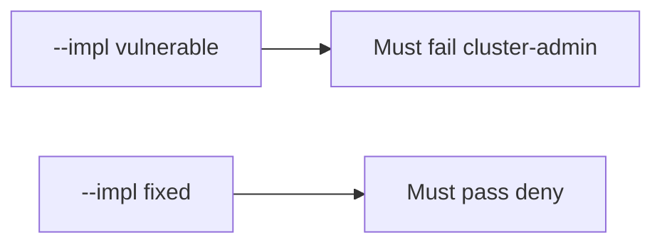

# 10.3-LO-05 — Evidence is cluster-admin denied, then a passing pair

**Kind:** verification-lab
**Loop step:** 5 Verify
**Standards:** ASVS `v5.0.0-13.2.1`.

## An invariant that cannot fail a test is still a slogan

“We use Kubernetes” is not evidence. The oracle is the local pair. Do not apply YAML to a live cluster.

## Mental model: vulnerable must fail: cluster-admin

The failing observation on `--impl vulnerable` is **cluster-admin**. A passing collection count is not this cell.



| Case | Must show |
|---|---|
| Negative / abuse | cluster-admin → not run |
| Normal | app → may run |
| Not claimed | live EKS; CIS score; Gate 10 |

```
python3 -m pytest labs/10.3/10.3-lab/tests --impl vulnerable
python3 -m pytest labs/10.3/10.3-lab/tests --impl fixed
```

Honest `app` may pass on both.

## What the tests do not prove

- PSS `restricted` on the real spec
- NetworkPolicy egress
- IMDS blocked
- Helm chart supply chain (10.2)

## Practice

Execute both implementations. Map each test to an LO-02 cell.

## Transfer

Clinic: a test that only asserts “namespace exists” is not this cell.
