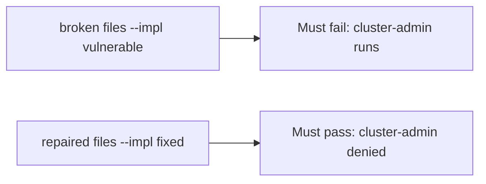

# A broken admission must fail the check

**Kind:** verification-lab
**Loop step:** 5 Verify

## Check it

"We use Kubernetes" is not evidence. "CIS is green" is a tool observation. The check is: `pod_ok("cluster-admin")` is false and `"app"` may run. That cluster-admin observation must be **false** on the broken files and **true** on the repaired files. Do not apply manifests to a live cluster.

## Picture: a broken admission must fail the check

A check that only counts passing tests can still look green while `pod_ok("cluster-admin")` still returns true.



If both pass, the test is not looking at cluster-admin.

## What the check has to show

| Mode | Must show for this topic |
|---|---|
| Normal | `app` → may run (may pass on both) |
| Wrong input | cluster-admin → cannot run; broken files must fail |
| Abuse | Unknown roles still deny (fail closed) |
| Not claimed | A live managed cluster; a CIS score; an assurance gate; that `"app"` is least privilege |

The test `test_cluster_admin_pod_is_denied` is there so always-true `pod_ok` cannot sneak through.

Honest `"app"` may pass on both implementations. That does not excuse the cluster-admin deny test. If the broken files do not fail `test_cluster_admin_pod_is_denied`, the lab is miswired — fix the wiring, not the assertion.

```text
python3 -m pytest labs/10.3/10.3-lab/tests --impl vulnerable
python3 -m pytest labs/10.3/10.3-lab/tests --impl fixed
```

A test that only greps `namespace:` in a chart without calling `pod_ok("cluster-admin")` is not this topic's evidence. This practice never opens a live cluster.

## What the tests do not prove

- A restricted pod profile on the real spec
- Network-policy egress
- Instance metadata blocked
- Helm chart supply chain
- Documented cluster-API retry (extra, advanced)
- An assurance gate complete

## Practice

```text
python3 -m pytest labs/10.3/10.3-lab/tests --impl vulnerable
python3 -m pytest labs/10.3/10.3-lab/tests --impl fixed
```

Reject a "test" that only greps `namespace:` in a chart without calling `pod_ok("cluster-admin")`.

## Use it somewhere new

A clinic example: a test that only asserts "namespace exists" is not this topic. A live kube-apiserver is out of scope.

## What this page is not doing

Do not treat a live cluster screenshot as proof. Do not log kubeconfig. Answer keys are not on this site. This page does not mark you as finished.
