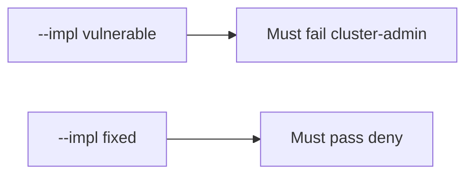

# 10.3-LO-05 — Evidence is cluster-admin denied, then a passing pair

**Kind:** verification-lab
**Loop step:** 5 Verify
**Standards:** ASVS `v5.0.0-13.2.1`. Kubernetes PSS as vocabulary, not the oracle.

## An invariant that cannot fail a test is still a slogan

“We use Kubernetes” is not evidence. “CIS is green” is a mechanism observation. The oracle is: `pod_ok("cluster-admin")` is false and `"app"` may run. The cluster-admin observation must be **false** on `--impl vulnerable` (returns true) and **true** on `--impl fixed`. Do not apply YAML to a live cluster.

## Mental model: vulnerable must fail: cluster-admin

The failing observation on `--impl vulnerable` is **cluster-admin**. A passing collection count is not this cell.



| Mode | Must show for this module |
|---|---|
| Negative / abuse | cluster-admin → not run; vulnerable must fail |
| Normal | app → may run (may pass on both) |
| Not claimed | live EKS; CIS score; Gate 10; that `"app"` is least privilege |

Lab tests in `labs/10.3/10.3-lab/tests/test_property.py`. `test_cluster_admin_pod_is_denied` is a **forbidden-outcome** test: always-true `pod_ok` is not allowed to count as a passing control.

```text
python3 -m pytest labs/10.3/10.3-lab/tests --impl vulnerable
python3 -m pytest labs/10.3/10.3-lab/tests --impl fixed
```

Honest `"app"` may pass on both implementations. That does not excuse the cluster-admin deny test. If vulnerable does not fail `test_cluster_admin_pod_is_denied`, the lab is miswired—fix the wiring, not the assertion.

## What the tests do not prove

- PSS `restricted` on the real spec
- NetworkPolicy egress
- IMDS blocked (6.5)
- Helm chart supply chain (10.2)
- `v5.0.0-13.2.6` Level 3 cluster-API retry docs
- Gate 10 / M4 complete

Record those as residuals or later modules, not as silent passes.

## Practice

Execute both implementations this session from the lab directory if needed. Write the fail/pass pair next to the matrix row. Reject a “test” that only greps `namespace:` in a chart without calling `pod_ok("cluster-admin")`.

## Transfer

Clinic: a test that only asserts “namespace exists” is not this cell. A live kube-apiserver is out of scope.

## Non-goals

Do not add a live-cluster trophy. Do not log kubeconfig. Keys stay out of this file. Gate 10 stays not-attempted.
