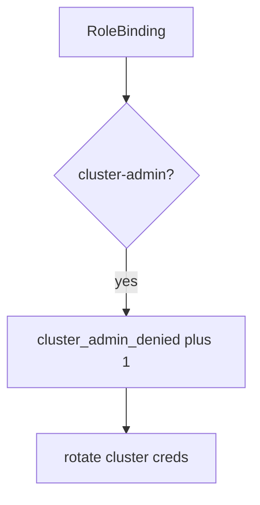

# cluster_admin_denied without logging kubeconfig

**Kind:** operations-exercise
**Loop step:** 6 Operate

## Stopping it is not enough

A chart can still add a ClusterRoleBinding after admission was "set once." Pair notice and recover. Do not log kubeconfig, cloud tokens, or node credentials. Do not paste `~/.kube/config` into the ticket.

## Picture: god-mode binding is a signal

A god-mode binding is a notice-and-recover problem, not a licence to quote kubeconfig in the paging channel. Notice names the ServiceAccount. Recover deletes the binding and rotates cluster credentials. Neither reprints kubeconfig.



Industry lists name detect, respond, recover. They do not pick a CIS product. They do not prove this ServiceAccount was least-privileged. Someone still has to own the leftover.

Re-run `test_cluster_admin_pod_is_denied` after any Helm change. A green "namespace private" tile is not that pytest. Break-glass ClusterRoles are a later elective — inventory them before you claim recover.

## Signals that do not become a second leak

| Outcome | This topic |
|---|---|
| Notice | `cluster_admin_denied` |
| What the line holds | SA name, intended Role, namespace; **never** kubeconfig |
| Respond | Stop the chart that added ClusterRoleBinding; do not paste kubeconfig into chat |
| Recover | Delete the binding; rotate cluster credentials |
| Leftover | Break-glass with a later elective; the metadata hop; Helm supply chain |

A CIS dashboard will show benchmark scores and stay silent when CI's `pod_ok` is always true. Detection must observe **cluster-admin is deny**, not "we use Kubernetes." If the alert includes a kubeconfig or a cloud token, you have opened a leftover-secret leak.

A log line a reviewer can accept looks like:

```text
log_denied reason=cluster_admin_denied sa=app ns=sc-prod requested=cluster-admin
```

Not: a kubeconfig, a cloud token, or "assurance gate complete."

If your alert includes the matching kubeconfig, you have copied the leak into the paging channel.

## What the framework does vs what you still have to check

The same lying `"app"` Role, metadata hop, and Helm convenience ClusterRoles that bypass this fixture will also bypass a "scan our CIS dashboard" detector. Name those places before you claim recover. A CIS-product name is not the rule.

Cause vs cost stays split here too: the **cause** is always-true admission (or a chart that adds ClusterRoleBinding); the **cost** is control-plane takeover from one app bug; **how you stop it** is the allow-list; **how you notice** is `cluster_admin_denied`; **how you recover** is delete-and-rotate. What the tool cannot do: this alert does not prove `"app"` is least privilege, and it does not block the metadata hop.

## Can people still use it

A denied admission must say *cluster-admin refused*, not only "assert False." Do not encode that reason as color only.

## Practice

Write one log line you would accept in review. Tie it to `labs/10.3/10.3-lab`.

```text
log_denied reason=cluster_admin_denied sa=app ns=sc-prod requested=cluster-admin
```

Reject any line that includes a kubeconfig, a cloud token, or "assurance gate complete."

## Use it somewhere new

Clinic: deny the ClusterRoleBinding; do not paste `~/.kube/config` into the ticket. Do not apply manifests to a live cluster.

## What this page is not doing

A CIS-benchmark product name is not the rule. Do not claim you finished an assurance gate. A restricted pod profile is not this alert. Answer keys stay out of lessons.
