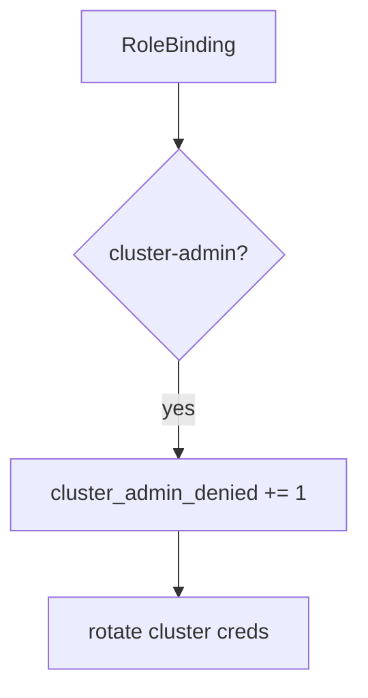

# 10.3-LO-06 — Detect cluster_admin_denied without logging kubeconfig

**Kind:** operations-exercise
**Loop step:** 6 Operate
**Standards:** NIST CSF 2.0 (final) DE/RS/RC as outcome labels; ASVS `v5.0.0-13.2.1`.

## Prevention is not absolute

A chart can add a ClusterRoleBinding after admission was “set once.” Pair detect and recover. Do not log kubeconfig, cloud tokens, or node IAM credentials (5.3 / 6.5).

## Mental model: god-mode binding is a signal



| Outcome | This module |
|---|---|
| Detect | `cluster_admin_denied` |
| Signal | SA name, intended Role, namespace; never kubeconfig |
| Recover | Delete the binding; rotate cluster credentials |
| Residual | Break-glass with E6; IMDS hop |

## Practice

Write one log line you would accept. Tie it to `labs/10.3/10.3-lab`.

```
log_denied reason=cluster_admin_denied sa=app ns=sc-prod requested=cluster-admin
```

Reject any line that includes a kubeconfig, a cloud token, or “Gate 10 complete.”

## Transfer

Clinic: deny the ClusterRoleBinding; do not paste `~/.kube/config` into the ticket.

## Non-goals

A CIS-benchmark product name is not the property. M4 stays not-attempted.
