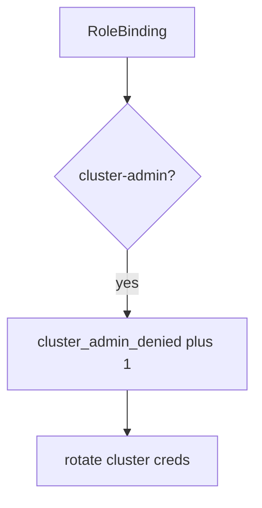

# 10.3-LO-06 — Detect cluster_admin_denied without logging kubeconfig

**Kind:** operations-exercise
**Loop step:** 6 Operate
**Standards:** NIST CSF 2.0 (final) DE/RS/RC as outcome labels; ASVS `v5.0.0-13.2.1`. NIST SP 800-190 as vocabulary.

## Prevention is not absolute

A chart can add a ClusterRoleBinding after admission was “set once.” Pair detect and recover. Do not log kubeconfig, cloud tokens, or node IAM credentials (5.3 / 6.5). Do not paste `~/.kube/config` into the ticket.

## Mental model: god-mode binding is a signal



| Outcome | This module |
|---|---|
| Detect | `cluster_admin_denied` |
| Signal | SA name, intended Role, namespace; never kubeconfig |
| Recover | Delete the binding; rotate cluster credentials |
| Residual | Break-glass with E6; IMDS hop; Helm supply chain |

CSF 2.0 Detect / Respond / Recover name outcomes. They do not prove `v5.0.0-13.2.1`. A CIS-product name is not the property. Re-run `test_cluster_admin_pod_is_denied` after any Helm change; a green “namespace private” tile is not that pytest. Break-glass ClusterRoles are E6 — inventory them before claiming Recover.

## Framework defaults versus the operate guarantee

A CIS dashboard will show benchmark scores and stay silent when CI’s `pod_ok` is always true. Detection must observe **cluster-admin is deny**, not “we use Kubernetes.” If the alert includes a kubeconfig or a cloud token, you have opened a 5.3 cell.

## Practice

Write one log line you would accept. Tie it to `labs/10.3/10.3-lab`.

```text
log_denied reason=cluster_admin_denied sa=app ns=sc-prod requested=cluster-admin
```

Reject any line that includes a kubeconfig, a cloud token, or “Gate 10 complete.”

## Transfer

Clinic: deny the ClusterRoleBinding; do not paste `~/.kube/config` into the ticket. Do not apply YAML to a live cluster.

## Usability

A denied admission must say *cluster-admin refused*, not only “assert False” (WCAG 2.2 Success Criterion 4.1.3 for human-read CI).

Cause vs impact stays split here too: the **cause** is always-true admission (or a chart that adds ClusterRoleBinding); the **impact** is control-plane takeover from one app bug; **prevention** is the allowlist; **detection** is `cluster_admin_denied`; **recovery** is delete-and-rotate. Mechanism limit: this alert does not prove `"app"` is least privilege, and it does not block the IMDS hop (6.5).

## Non-goals

A CIS-benchmark product name is not the property. M4 stays not-attempted. PSS is not this alert.
