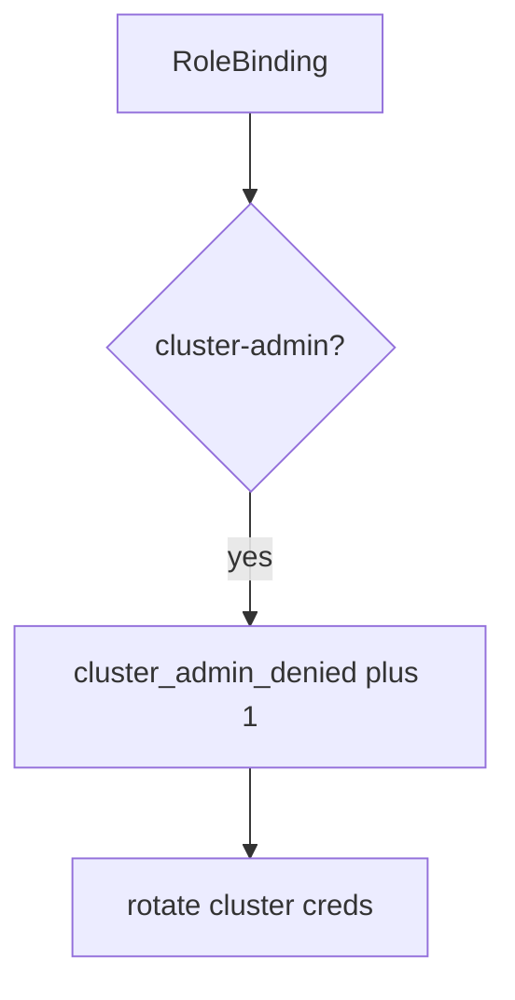

# Log the cluster-admin deny, not the kubeconfig

**Kind:** operations-exercise
**Loop step:** 6 Operate

## Fixing it once is not enough

A chart can still add a ClusterRoleBinding. Keep kubeconfig, cloud tokens, node credentials, and `~/.kube/config` out of the ticket.

## Picture: god-mode binding is a signal

If a binding is cluster-admin, page the ServiceAccount — not the kubeconfig. Then delete the binding and rotate cluster credentials.



A CIS dashboard does not delete cluster-admin.

A cluster-admin Role still has to be denied in `test_cluster_admin_pod_is_denied`. A “private” namespace does not delete cluster-admin. Break-glass ClusterRoles can still admit cluster-admin; the binding is not gone until those roles are named.

## Signals that do not become a second leak

| Outcome | This topic |
|---|---|
| Notice | `cluster_admin_denied` |
| What the line holds | SA name, intended Role, namespace; **never** kubeconfig |
| Respond | Stop the chart that added ClusterRoleBinding; do not paste kubeconfig into chat |
| Recover | Delete the binding; rotate cluster credentials |
| Leftover | Break-glass with a later elective; the metadata hop; Helm supply chain |

A CIS dashboard will show benchmark scores and stay silent when CI's `pod_ok` is always true. Detection must observe **cluster-admin is deny**, not "we use Kubernetes." If the alert includes a kubeconfig or a cloud token, you have opened a leftover-secret leak.

```text
log_denied reason=cluster_admin_denied sa=app ns=sc-prod requested=cluster-admin
```

Not: a kubeconfig, a cloud token, or "assurance gate complete."

Putting the matching kubeconfig in the alert puts cluster credentials in the pager too.

## What the framework does vs what you still have to check

A lying `"app"` Role, metadata hop, and Helm convenience ClusterRoles still admit cluster-admin even if the CIS dashboard is green.

The **cause** is always-true admission (or a chart that adds ClusterRoleBinding); the **cost** is control-plane takeover from one app bug; **how you stop it** is the allow-list; **how you notice** is `cluster_admin_denied`; **how you recover** is delete-and-rotate. What the tool cannot do: this alert does not prove `"app"` is least privilege, and it does not block the metadata hop.

## Can people still use it

A denied admission must say *cluster-admin refused*, not only "assert False." Do not encode that reason as color only.

## Practice

```text
log_denied reason=cluster_admin_denied sa=app ns=sc-prod requested=cluster-admin
```

Reject any line that includes a kubeconfig, a cloud token, or "assurance gate complete."

## Use it somewhere new

Deny the ClusterRoleBinding; do not paste `~/.kube/config` into the ticket. Do not apply manifests to a live cluster.

## What this page is not doing

A CIS-benchmark sticker does not deny cluster-admin. This page does not mark you as finished. A restricted pod profile does not delete the ClusterRoleBinding. Answer keys are not on this site.
