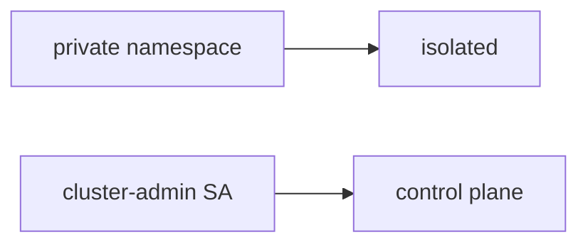

# 10.3-LO-07 — Transfer: clinic app SA is cluster-admin

**Kind:** transfer-challenge
**Loop step:** 7 Transfer
**Standards:** NIST SP 800-190 as stack vocabulary. Kubernetes PSS as pod hardening. ASVS `v5.0.0-13.2.1`.

## Change the workplace; keep namespace from meaning isolation

Do not answer with a Top 10 / CWE / scanner as the definition of security.

**Prompt:** Clinic: app SA is cluster-admin. Also name serverless IAM `*`.

**Product sketch:** EHR-lite “the API namespace is private so ClusterRole is fine,” plus “we attached a NetworkPolicy and a CIS Kubernetes scan.”

Rewrite the SecureCollab sentence. Include:

1. attacker capabilities (compromised container / malicious chart — not a live clinic cluster attack);
2. trust assumptions (allowlisted namespaced role is TCB; namespace/NetworkPolicy/PSS/CIS are not);
3. forbidden outcome (`pod_ok("cluster-admin")` true, not “HIPAA”);
4. a test idea on a **local** fixture only (no live kube-apiserver);
5. residual (break-glass E6, IMDS hop, `v5.0.0-13.2.6` Level 3);
6. WCAG if admission is human-read (say cluster-admin refused).

## Mental model: private namespace vs ClusterRole

## What graders reject

| Reject | Why |
|---|---|
| “we have NetworkPolicy” | Egress, not RBAC |
| Live cluster / cloud takeover tutorial | Lab policy |
| “PSS restricted so 1.2 is done” | Pod spec ≠ API authorization |

## Practice

One page. No keys. `labs/10.3/10.3-lab` is the only running system you may break.
