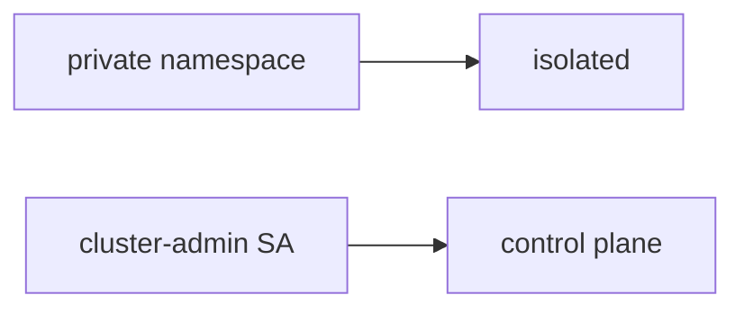

# Same idea when a clinic app account is cluster-admin

**Kind:** transfer-challenge
**Loop step:** 7 Transfer

## Use it somewhere new

You get a **clinic app ServiceAccount that is cluster-admin**.

`pod_ok("cluster-admin")` must be false. For a clinic, cluster-admin denied, app may run. A private namespace is still a name, not isolation.

An EHR-lite "the API namespace is private so ClusterRole is fine," plus "we attached a network policy and a CIS Kubernetes scan."

## Picture: same admission loop, clinical object

Put the clinic pod through the same role allow-list as the notes-app process. Putting the app in a private namespace does not put `"app"` in `ALLOWED_ROLES`.

| Notes app | Clinic sketch |
|---|---|
| App pod must not be cluster-admin | Clinic API SA must not be cluster-admin |
| `pod_ok("cluster-admin")` false | Same call — cluster-admin still denied |
| Namespaced `"app"` may run | Same allow-list — local practice files only |
| Compromised container / malicious chart | Same actors — **not** a live clinic cluster |
| Namespace / network policy / CIS scan | Same inputs — not the admission decision |

If the namespace is "private" while `pod_ok` is always true, the rule is gone. A network policy, a restricted pod profile, and a CIS scan do not put `"app"` in `ALLOWED_ROLES`. Serverless IAM `*` is the same god-mode grain on a different object — name it, do not attack a live cloud account here. A container-stack guide names five layers; it does not make a managed cluster secure by default. Documented cluster-API retry is extra, advanced work, not this check.

`cluster-admin` still has to be denied. The app may still run. Adding a namespace without an allow-list leaves `pod_ok("cluster-admin")` true. The local check is `test_cluster_admin_pod_is_denied` — on a practice, not a live cluster.

## Write this for a clinic app SA is cluster-admin

1. who might try (compromised container / malicious chart — not a live clinic cluster);
2. what you trust (allow-listed namespaced role is the promise; namespace, network policy, restricted pod profile, and CIS are not);
3. what must not happen (`pod_ok("cluster-admin")` true);
4. cluster-admin is deny belongs in **local** practice files (no live kube-apiserver);
5. leftover (break-glass elective, metadata hop, documented cluster-API retry);
6. whether engineers read the denial (say cluster-admin refused, not color only).

Use fake labels. Do not use real patient names.

Also name serverless IAM `*`.

## What is not good enough

| Reject | Why |
|---|---|
| "we have a network policy" | Egress, not who-is-allowed on the API |
| Live cluster / cloud takeover tutorial | Course rules |
| "restricted pod profile so who-is-allowed is done" | Pod spec is not API authorization |
| "CIS scan green" | Benchmark, not the predicate |
| "check-in complete" | Forbidden stamp |

## Practice

Deny the pod that is cluster-admin. Keep the answer keys closed. `labs/10.3/10.3-lab` is the only running system you may break. Do not apply manifests to a live cluster.

## What this page is not doing

Do not run live-cluster attacks. Do not use real cloud-account takeover. This page does not finish a check-in.
