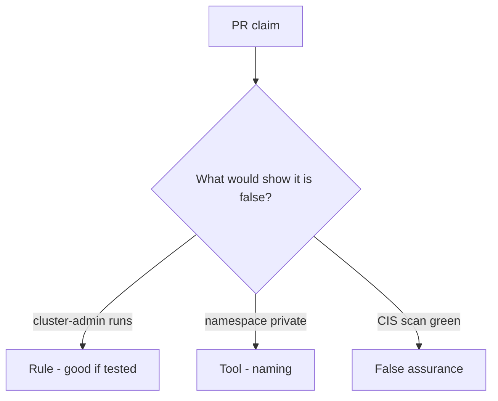

# Would you merge this always-true pod_ok?

**Kind:** code-review
**Loop step:** Review

## What you are reviewing

Read `labs/10.3/10.3-lab/vulnerable/` the way you would review cluster admission. Does `pod_ok("cluster-admin")` still return true?

Look at `pod_ok` and the cluster-admin row. A CIS screenshot can wait. Shipping "will tighten RBAC later" leaves `test_cluster_admin_pod_is_denied` failing.

## Picture: cluster-admin on app SA

**cluster-admin on app SA**.

`cluster-admin` still has to be denied. If the change never checks allow-list membership, that always-run leftover is still open. A CIS screenshot does not replace that check.

A restricted pod profile is pod spec. A network policy is egress. Instance metadata is a sibling leftover. Name them, do not skip `test_cluster_admin_pod_is_denied`. This page does not mark you as finished. Do not apply manifests to a live cluster to prove the finding.

## Problems to find (name them yourself)

- cluster-admin on app SA
- `privileged: true`
- No admission test
- IaC with `0.0.0.0/0`

Also reject: live cluster attacks; admitting without re-running `test_cluster_admin_pod_is_denied`; keys in learner notes; treating this cluster lesson as a check-in.

## Common mix-ups

- Namespace equals tenant
- Managed Kubernetes is secure by default
- A network policy is who-is-allowed on the API
- A restricted pod profile is `pod_ok`
- A CIS score is not a check-in

## Use it somewhere new

A namespace and a CIS scan, without a ClusterRole deny, do not finish admission. Which deny still has to hold so cluster-admin cannot run in that namespace?

## Can people still use it

A denied admission must say why the pod stayed out (cluster-admin refused), not only "will tighten RBAC later."

## What this page is not doing

A cluster-admin pod that still runs, plus "will tighten RBAC later," has no owner. Do not attack a live cluster to prove the finding.
