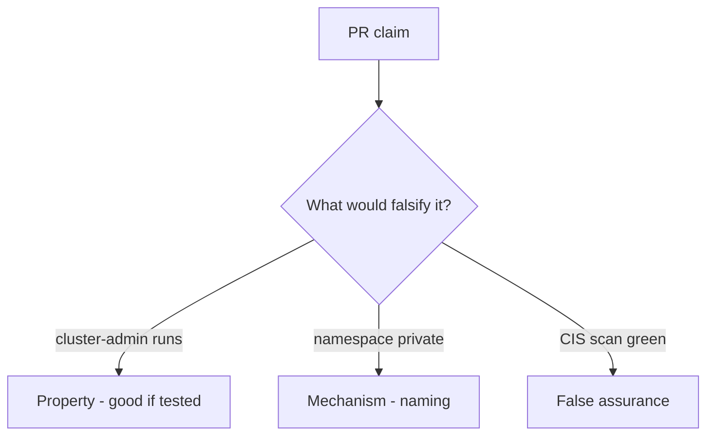

# 10.3-LO-08 — Review always-true pod_ok as a PR

**Kind:** code-review
**Loop step:** Review
**Standards:** ASVS `v5.0.0-13.2.1`, `v5.0.0-13.2.2`, `v5.0.0-13.2.4`. Kubernetes PSS as vocabulary.

## Review the fixture as if it were SecureCollab cluster IAM

Review `labs/10.3/10.3-lab/vulnerable/` as a SecureCollab PR. Intended findings live only in `content/assessment/keys/10.3.md` — not here.

## Mental model: property, mechanism, or false assurance

Seeded smells (label them yourself; do not open the keys file):

- cluster-admin on app SA
- `privileged: true`
- No admission test
- IaC with `0.0.0.0/0`

Also reject: live cluster attacks, keys in lessons, claiming Gate 10 or M4.

## Misconceptions

- Namespace equals tenant
- Managed Kubernetes is secure by default
- NetworkPolicy is RBAC

## Practice

Write three review notes. Tie at least one to `test_cluster_admin_pod_is_denied`.

## Transfer

Clinic PR that “added a namespace and a CIS scan” without a ClusterRole deny is incomplete.
