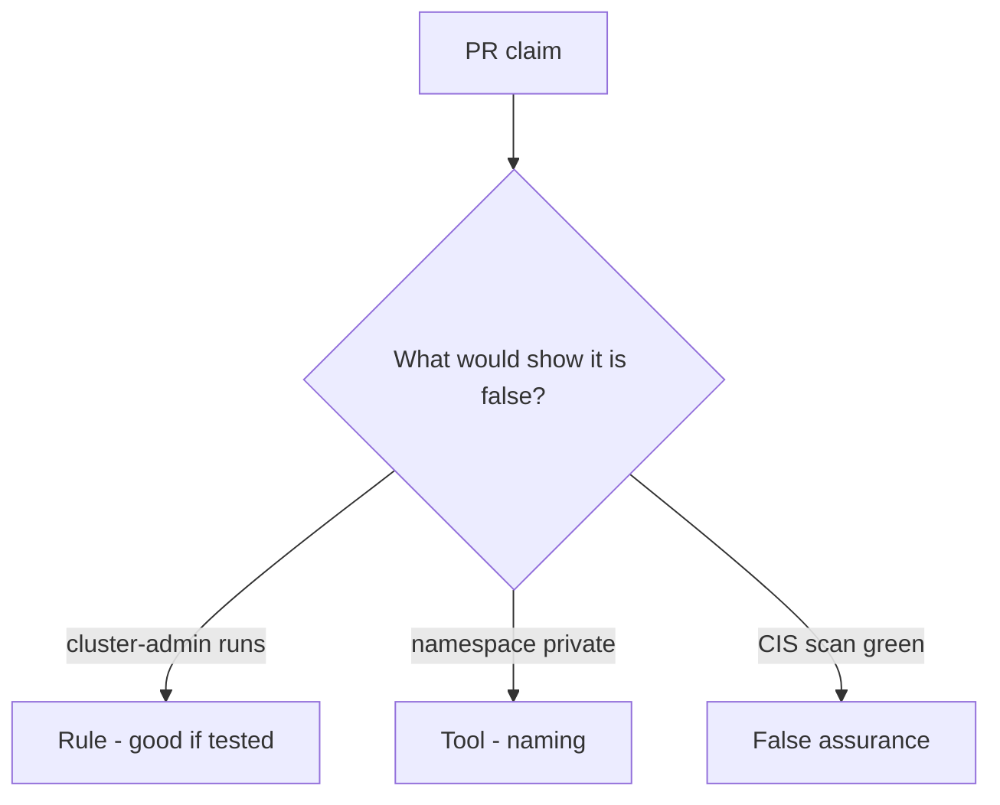

# Would you merge this always-true pod_ok?

**Kind:** code-review
**Loop step:** Review

The answers are not on this page. Do not open the keys file until someone has looked at your review.

## What you are reviewing

Review `labs/10.3/10.3-lab/vulnerable/` as a change to the notes app's cluster admission. Check whether `pod_ok("cluster-admin")` still returns true.

Start at `pod_ok` and the cluster-admin row, not at a scanner color or a CIS screenshot. The check you already ran (`test_cluster_admin_pod_is_denied`) is the rule test. A comment "will tighten RBAC later" is not.

## Picture: cluster-admin on app SA

**cluster-admin on app SA**. Label it rule, tool, or false assurance before you accept the change.

`cluster-admin` still has to be denied. If the change never checks allow-list membership, that always-run leftover is still open. A CIS screenshot does not replace that check.

A restricted pod profile is pod spec. A network policy is egress. Instance metadata is a sibling leftover. Name them, do not skip `test_cluster_admin_pod_is_denied`. This page does not mark you as finished. Do not apply manifests to a live cluster to prove the finding.

## Problems to find (name them yourself)

- cluster-admin on app SA
- `privileged: true`
- No admission test
- IaC with `0.0.0.0/0`

Also reject: live cluster attacks; admitting without re-running `test_cluster_admin_pod_is_denied`; keys in learner notes; claiming an assurance gate.

## Common mix-ups

- Namespace equals tenant
- Managed Kubernetes is secure by default
- A network policy is who-is-allowed on the API
- A restricted pod profile is `pod_ok`
- A CIS score is an assurance gate

## Practice

Write three notes a maintainer could act on, and tie at least one to `test_cluster_admin_pod_is_denied`. For each: what you saw, whether it is a rule or false assurance, a structural change, leftover you will **not** delete.

## Use it somewhere new

Clinic change that "added a namespace and a CIS scan" without a ClusterRole deny is an incomplete admission review. Name the independent falsehood that would still keep cluster-admin from running.

## Can people still use it

A denied admission must say why the pod stayed out (cluster-admin refused), not only "will tighten RBAC later."

## What this page is not doing

Do not merge by adding a comment "will tighten RBAC later." That comment is leftover without an owner. Do not attack a live cluster to prove the finding.
