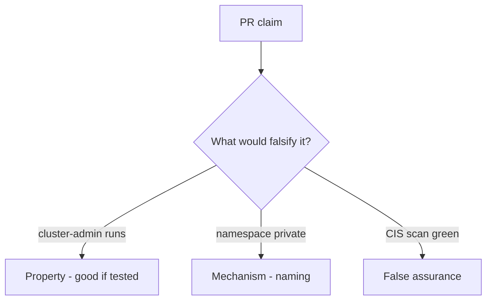

# 10.3-LO-08 — Review always-true pod_ok as a PR

**Kind:** code-review
**Loop step:** Review
**Standards:** ASVS `v5.0.0-13.2.1`, `v5.0.0-13.2.2`, `v5.0.0-13.2.4`. Kubernetes PSS as vocabulary.

## Review the fixture as if it were SecureCollab cluster IAM

Review `labs/10.3/10.3-lab/vulnerable/` as a SecureCollab PR. Your job is not to count suspicious lines. Reconstruct whether `pod_ok("cluster-admin")` still returns true, compare that with the module invariant, and write changes a developer can verify.

Intended findings live only in `content/assessment/keys/10.3.md` — not here. Do not open the keys file until your review has been evaluated.

## Mental model: cluster-admin on app SA

Start with this seeded smell: **cluster-admin on app SA**. Label it property, mechanism, or false assurance before you accept the PR.

Classification starts at the protected effect (cluster-admin denied). Everything that is not allowlist membership at that call is a candidate always-run path. A CIS screenshot without that pytest is the same smell, not a different finding class.

PSS is pod spec. NetworkPolicy is egress. IMDS is 6.5. Do not skip `test_cluster_admin_pod_is_denied`. Do not claim Gate 10. Do not apply YAML to a live cluster to prove the finding.

## Seeded smells (label them yourself)

- cluster-admin on app SA
- `privileged: true`
- No admission test
- IaC with `0.0.0.0/0`

Also reject: live cluster attacks; admitting without re-running `test_cluster_admin_pod_is_denied`; keys in lessons; claiming Gate 10 or M4.

## Misconceptions this module refuses

- Namespace equals tenant
- Managed Kubernetes is secure by default
- NetworkPolicy is RBAC
- PSS `restricted` is `pod_ok`
- A CIS score is Gate 10

## Practice

Write three review notes a maintainer could act on. Each note: observation, property or false assurance, suggested structural change, residual you will **not** delete. Tie at least one to `test_cluster_admin_pod_is_denied`.

## Transfer

Clinic PR that “added a namespace and a CIS scan” without a ClusterRole deny is an incomplete admission review. Name the independent falsehood that would still keep cluster-admin from running.

## Non-goals

Do not merge by adding a comment “will tighten RBAC later.” That comment is a residual without an owner. Do not attack a live cluster to prove the finding.
