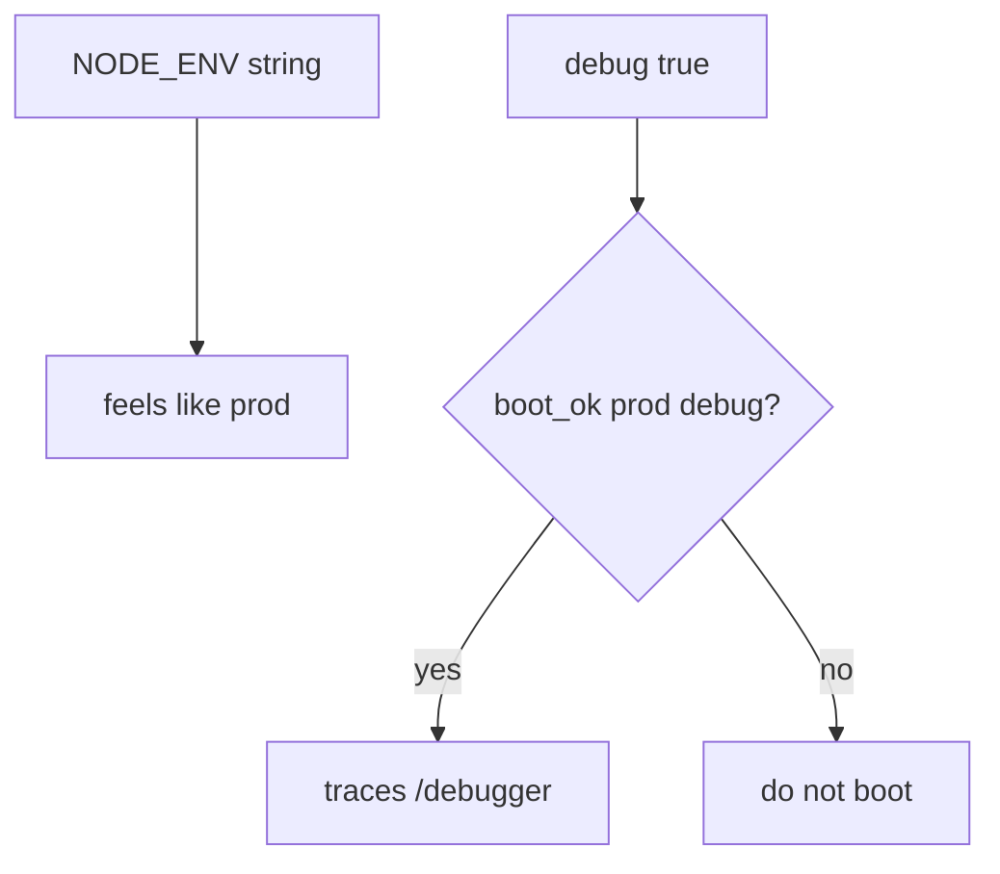
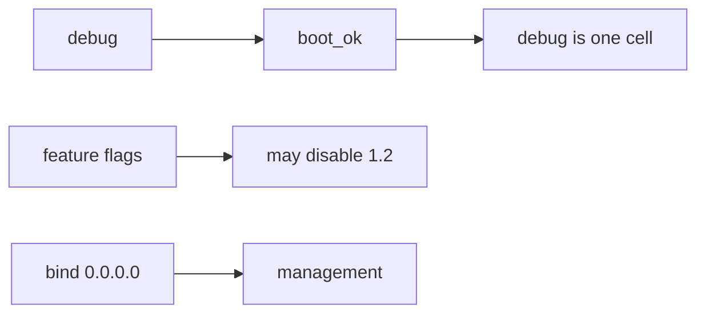

# 10.4-LO-01 — Production must not boot with debug

**Kind:** concept-model
**Loop step:** 1 Property
**Standards:** ASVS `v5.0.0-13.4.2`, `v5.0.0-13.4.5`, `v5.0.0-13.3.1`; `v5.0.0-13.4.6` is **Level 3, advanced**. CISA Secure by Design is **unverified**. Top 10:2025 A02 is **awareness after** the cause.

## The claim this module owns

SecureCollab’s FastAPI + Next.js compose file has an `env` and a `debug` flag. **Least privilege of the running config** is whether production can boot with debug features. `NODE_ENV=production` is a string in a file. It is not this check.

> `boot_ok("prod", True)` must be false. `boot_ok("prod", False)` may be true.

The forbidden outcome is **production process boots with debug enabled**. That leaks stack traces, interactive debuggers, extra headers, and sometimes secrets (5.3 / `v5.0.0-13.3.1`).

ASVS `v5.0.0-13.4.2` wants debug modes disabled for all components in production. `v5.0.0-13.4.5` wants documentation and monitoring endpoints not exposed unless intended. `v5.0.0-13.3.1` wants secrets out of artifacts and traces. `v5.0.0-13.4.6` (detailed backend version leakage) is **Level 3, advanced**. CISA Secure by Design is a living program page previously fetched as 403 — cite it as **unverified**, not as the lab oracle. Top 10:2025 A02 is a regression label after the fail-open cause, not the syllabus.

## Mental model: flag vs environment name



## Mental model: config is TCB



**Mechanism (not the property):** compose `NODE_ENV`, a canary, IaC that exists, a CIS benchmark.

## Root cause vs impact vs prevention vs detection vs recovery

| Slice | For this property |
|---|---|
| Root cause | Fail-open defaults |
| Preconditions | `boot_ok("prod", True)` true |
| Trigger | Anyone who finds `/debug` or an error page |
| Impact | Confidentiality of traces + extra attack surface |
| Prevention | Refuse boot; do not register debug routes |
| Detection | `prod_debug_forbidden` |
| Recovery | Kill; rotate secrets that appeared in traces |

## Framework defaults versus the boot guarantee

Next.js will run with `NODE_ENV=development` if you tell compose to. FastAPI `debug=True` is a constructor argument, not a cloud setting. Django `DEBUG` is the clinic grain.

## Mechanism limits

- `debug=False` still has other flags (feature, migration).
- Sidecar debug container.
- Admin on `0.0.0.0`; public `/metrics` (`v5.0.0-13.4.5`).
- “Just for five minutes” is still a production boot.

## Usability and accessibility

Boot failure must say *prod debug refused* in text, not only a red container (WCAG 2.2 4.1.3).

## Practice

Name the compose flags and who can change them. Then run:

```
python3 -m pytest labs/10.4/10.4-lab/tests --impl vulnerable
python3 -m pytest labs/10.4/10.4-lab/tests --impl fixed
```

The first command must fail. The second must pass.

## Transfer

Feature flag that disables authz. Clinic: Django `DEBUG=True`.

## Non-goals

Live production hosts, claiming Gate 10 or M4. Answer keys are not in this file.
