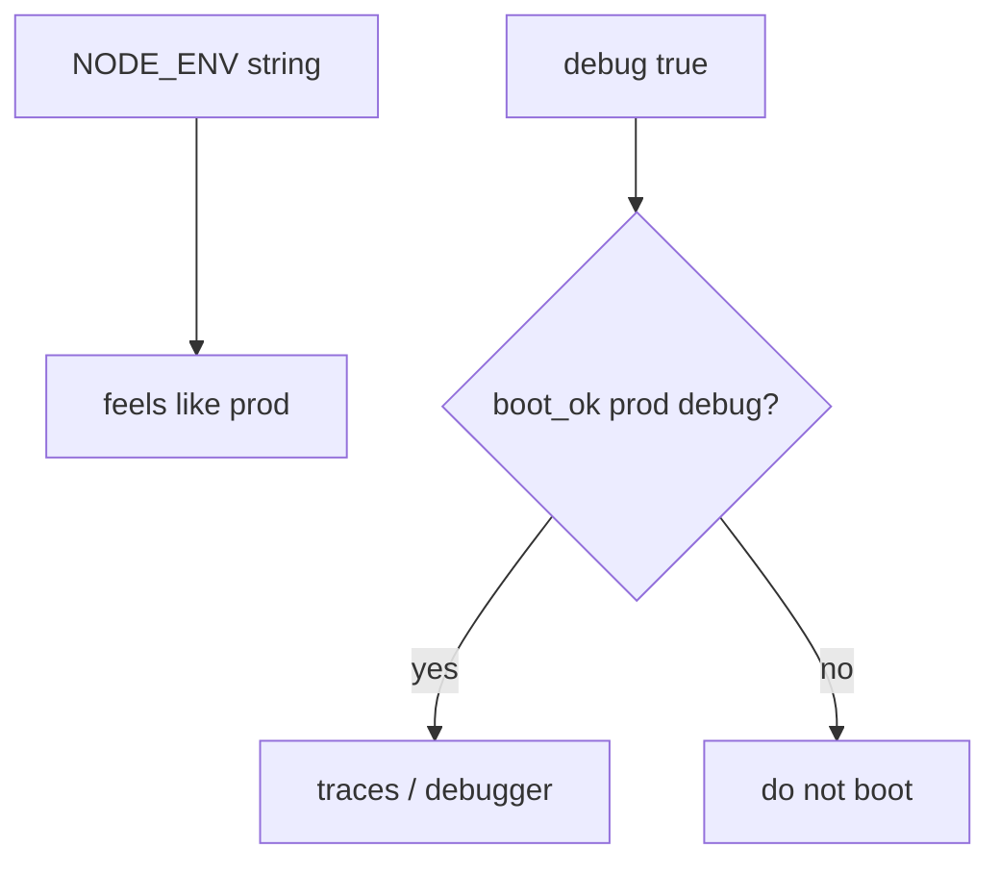
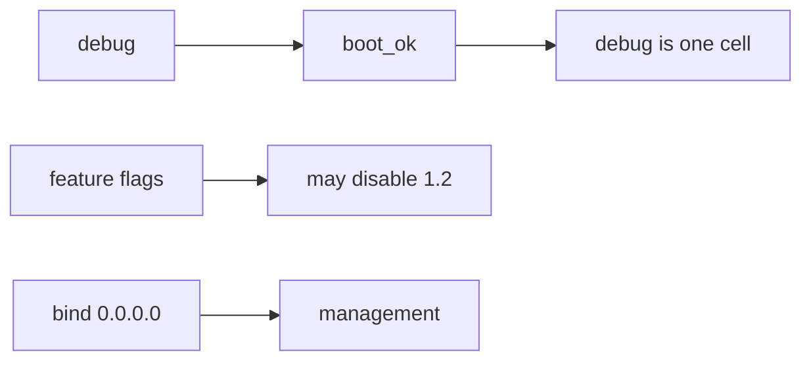

# Production must not boot with debug

**Kind:** concept-model
**Loop step:** 1 Property

## The rule

The notes app’s FastAPI and Next.js compose file has an `env` name and a `debug` flag. Least privilege of the running config is whether production can start with debug on. `NODE_ENV=production` is a string in a file. Production can still boot with debug on.

> `boot_ok("prod", True)` must be false. `boot_ok("prod", False)` may be true.

What must not happen: **a production process boots with debug enabled**. That leaks stack traces, interactive debuggers, extra headers, and sometimes secrets. The secrets lesson already said keep secrets out of traces.

A checklist that wants debug modes off in production is vocabulary, not this function. Docs and monitoring pages should stay off unless you meant to expose them. Extra detail about leaking backend version numbers is extra, advanced work, not this check. A manufacturer-defaults program page we have not verified is not the lab’s answer key. A famous-bugs list is a label you apply *after* you find the fail-open cause. It is not this rule.

## Picture: a flag vs an environment name



## Picture: config is what you trust



**A tool, not the rule:** compose `NODE_ENV`, a canary, an IaC file that exists, a benchmark score.

## Who can turn debug on in production

| Person | What they can do here | Motive | Harm if prod boots with debug |
|---|---|---|---|
| Anyone who finds `/debug` or an error page | Read traces, hit a debugger | Curiosity or theft | Secrets and extra attack surface |
| Support who asked for five minutes | Flip debug so they can see a trace | Help a user | The process is still a production boot |
| Someone who trusts `NODE_ENV=production` | Treat a string as the check | Looks like prod | `boot_ok("prod", True)` still returns true |

You do not need a live production host. Those three already get the leak if boot always says yes.

## Why it happens, what it costs, how you stop it, how you notice, how you recover

Fail-open defaults. Start there. The person who later reads a stack trace is the later mess.

| Slice | For this rule |
|---|---|
| Why it happens | Fail-open defaults; debug is ignored |
| What's already wrong | `boot_ok("prod", True)` is true |
| Trigger | Anyone who finds `/debug` or an error page |
| What it costs | Confidentiality of traces plus extra attack surface |
| How you stop it | Refuse boot; do not register debug routes |
| How you notice | `prod_debug_forbidden` |
| How you recover | Kill the process; rotate secrets that appeared in traces |

## What the framework does vs what you still have to check

Next.js will run with `NODE_ENV=development` if you tell compose to. FastAPI `debug=True` is a constructor argument, not a cloud setting. Django `DEBUG` is the clinic grain. Compose will start whatever you wrote.

Production plus debug is deny — files in `labs/10.4/10.4-lab`. Fake flags only. No live production hosts.

## What the tool cannot do

- `debug=False` still leaves other flags (feature flags, migrations).
- A sidecar debug container can still leak.
- Admin bound to `0.0.0.0`; a public `/metrics` page.
- “Just for five minutes” is still a production boot.
- Extra version leakage with debug already off is extra, advanced work.

## Can people still use it

A refused boot must say *prod debug refused* in text, not only a red container. Do not encode the reason as color only.

## Practice

Name the compose flags and who can change them. Then run:

```text
python3 -m pytest labs/10.4/10.4-lab/tests --impl vulnerable
python3 -m pytest labs/10.4/10.4-lab/tests --impl fixed
```

## Use it somewhere new

A feature flag that turns off authorization. Django `DEBUG=True` is the same fail-open boot.

## What this page is not doing

Do not use live production hosts. This page does not finish a check-in. Answer keys are not on this site.
