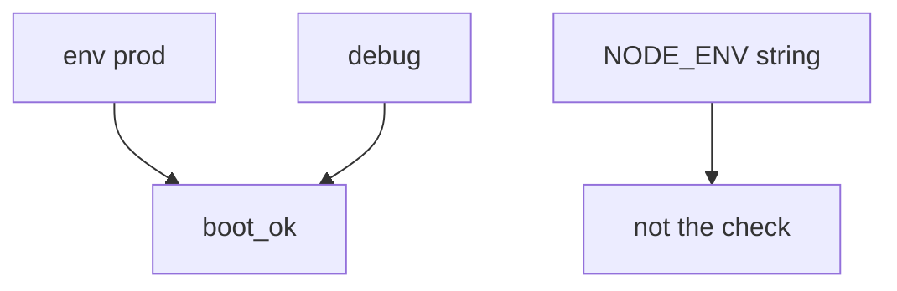
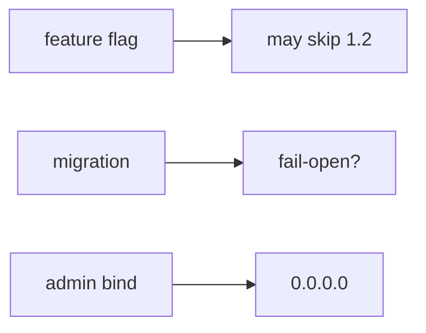

# Boot flags vs NODE_ENV slogans

**Kind:** design-exercise
**Loop step:** 2 Model

## Could someone else name the boot check from your compose map?

“We set `NODE_ENV=production`” is not this lesson. A drawing someone else can test names **env, debug, who can edit compose, the admin bind address, whether a migration fails open, and rollback**.

`boot_ok(env, debug)` is local. No live production hosts.

> For boot, the rule is deny when `env` is `"prod"` and `debug` is true. Production without debug may boot. Evidence that the deny is false: `boot_ok("prod", True)` returns true.

If the env × debug row is blank, the process starts because nobody named the check.

## Picture: two flags

## Picture: leftover you still have to trust

`NODE_ENV` is a slogan until something compares `env` to `debug`. A feature flag that turns off authorization, a migration that fails open, and an admin port bound to the world are other leftover — same family, not this check.

## Step 1: name the pieces

Take the boot rule you already have and ask what would show production started with debug on.

| Piece | This system |
|---|---|
| Who | Anyone who finds `/debug`; an error-page scraper |
| What | Running config; traces |
| Actions | `boot_ok` |
| Paths | Compose; feature flags; admin port |
| What you trust for this journey | Prod plus debug is deny |
| What you do not trust | The `NODE_ENV` string; a canary; an IaC file that exists |
| Time | Deploy; “five minutes”; rollback |
| The rule | Least privilege of the running config |

## Step 2: write allow and deny

| Who | What | Action | Decision |
|---|---|---|---|
| prod + debug | boot | allow | deny |
| prod + not debug | boot | allow | may allow |
| `NODE_ENV=production` | boot | treat as the check | deny |
| feature flag turns off authz | request | treat as leftover config | deny |

A missing prod-plus-debug deny is how a compose slogan becomes false assurance. Write the hole.

## Practice

In `labs/10.4/10.4-lab`, mark `cfg.py`.

## Use it somewhere new

Django `DEBUG=True` is the same grain with different syntax.

## What can still go wrong

Other flags. A sidecar debug container. Extra version leakage with debug already off (extra, advanced work). Emergency debug without an expiry (E6).

## What this page is not doing

Answer keys are not on this site.
