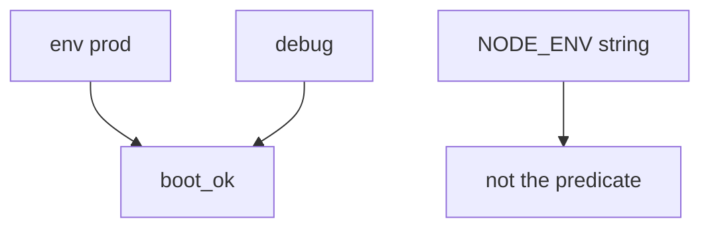
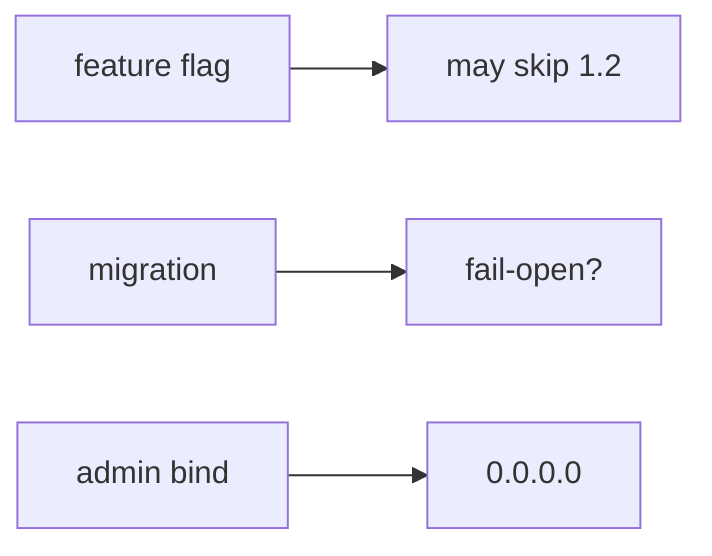

# 10.4-LO-02 — Boot flags vs NODE_ENV slogans

**Kind:** design-exercise
**Loop step:** 2 Model
**Standards:** ASVS `v5.0.0-13.4.2`, `v5.0.0-13.4.5`, `v5.0.0-13.3.1`.

## Can a second engineer name the boot check from your compose map?

“We set NODE_ENV=production” is not this lesson. A reviewable model names **env, debug, who can edit compose, admin bind address, migration fail-open, and rollback**.

SecureCollab freeze: local `boot_ok(env, debug)`. No live production hosts.

## Mental model: two flags

## Mental model: other TCB leftover

## Step 1: freeze pieces

| Piece | This system |
|---|---|
| Subjects | anyone who finds `/debug`; error-page scraper |
| Objects | running config; traces |
| Actions | `boot_ok` |
| Channels | compose; feature flags; admin port |
| TCB | prod+debug deny |
| Untrusted | NODE_ENV string; canary; IaC existence |
| State / time | deploy; “five minutes”; rollback |
| 1.1 cell | least privilege of the running config |

## Step 2: write cells

| Subject | Object | Action | Decision |
|---|---|---|---|
| prod + debug | boot | allow | deny |
| prod + not debug | boot | allow | may allow |
| NODE_ENV=production | boot | treat as check | deny |
| feature flag disables authz | request | treat as config leftover | deny |

## Practice

Draw the map. Point at `labs/10.4/10.4-lab` file `cfg.py`.

## Transfer

Django `DEBUG=True` is the same grain with different syntax.

## Residual risk

Other flags; sidecar debug; `v5.0.0-13.4.6` Level 3 version leakage; emergency debug with E6.

## Non-goals

Top 10 as the definition of security. Keys stay out of lessons.
