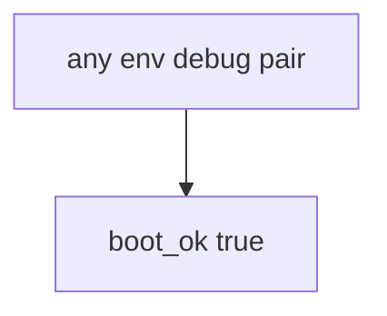

# Practice: always-true boot_ok

**Kind:** mechanism-lab
**Loop step:** 3 Break

## Try it

The practice is not a website you attack. It is a tiny Python `boot_ok(env, debug)` that returns true for every pair. The failure is already in the function: it never looks at `env` or `debug`. Watch the check treat that always-true boot as a **failed rule**, not as a missing compose comment.

The rule under test:

> Production must not boot with debug on. If `boot_ok("prod", True)` returns true, the boot gate has failed as a security control.

## Where you may practice

Only `labs/10.4/10.4-lab` is in scope. The practice is an in-process `boot_ok(env, debug)`. The flags are synthetic strings and booleans. Do **not** turn debug on a real production host, staging SaaS, or someone else’s compose “to see what happens.”

Do not paste this exercise onto a public clinic, employer cluster, or live hospital portal.

What is supposed to stop this: `boot_ok` is supposed to refuse **prod plus debug**. Compose strings, FastAPI debug defaults, a canary percentage, and a manufacturer-defaults program page we have not verified are not enough.

Who can get the leak in this story: anyone who finds an error page or a debug route. That stands in for “we left DEBUG on for five minutes so support can see traces,” `NODE_ENV=production` treated as the check, or a 10% canary treated as hardening.

## Picture: boot always says yes



The broken files take that path on purpose. You do not need Docker. You must not boot a live host. The true return for `("prod", True)` *is* the leak.

The secrets lesson already said keep secrets out of traces. This check is **the process must not start**.

## What to look at — cause, not a dump

Read `vulnerable/cfg.py`. It returns true for every pair. Tests:

- `test_prod_debug_must_not_boot`
- `test_prod_without_debug_may_boot` — `("prod", False)` may pass on both

You do not need a new flag. The failure of `test_prod_debug_must_not_boot` *is* the evidence.

Do not open the repaired files yet. Diagnose the cause first.

| What you see | What kind of failure | Not the lesson |
|---|---|---|
| `return True` for every pair | Fail-open; debug ignored | “`NODE_ENV` is production” |
| `("prod", True)` still boots | What must not happen is allowed | A canary percentage |
| No look at `env` and `debug` | The gate accepted prod plus debug | A live compose file |

## Why it happens vs what it costs

| Slice | Practice |
|---|---|
| The rule | `boot_ok("prod", True)` is false |
| Why it happens | Fail-open defaults; debug ignored |
| What has to be true first | `boot_ok` true for every pair |
| Trigger | Anyone who finds `/debug` or an error page |
| What it costs | Traces, debugger, secret leak |
| How you stop it later | Refuse boot when prod and debug |
| How you notice later | `prod_debug_forbidden`; never trace bodies |
| How you recover later | Kill the process; rotate secrets that appeared in traces |
| Out of scope | A canary percentage; live compose; claiming an assurance gate |

FastAPI `debug=True` is a developer default. Next.js will print stack traces when `NODE_ENV` is not production — and the string can lie. Compose will start whatever you wrote. The notes app’s promise this week is: **this** practice, prod plus debug is deny.

## Practice

From the repository root, in a throwaway environment:

```text
python3 -m pytest labs/10.4/10.4-lab/tests --impl vulnerable
```

Run from `labs/10.4/10.4-lab` if a collection at the repo root picks up `site/`. Record `test_prod_debug_must_not_boot`. Do not probe public hosts. A setup error is not proof the rule holds.

## Use it somewhere new

Clinic Django `DEBUG=True`: predict without leaving this directory. Do not hit a live `/debug`.

## What this page is not doing

No live-production, staging-SaaS, or public debug-endpoint instructions. Fake `env` / `debug` flags only. This page does not mark you as finished. A famous-bugs list stays awareness after the cause. A manufacturer-defaults program page stays unverified.
