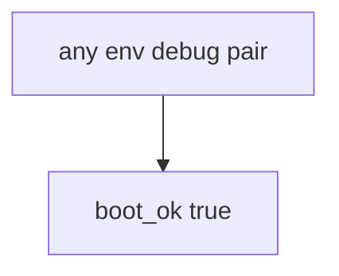

# 10.4-LO-03 — Observe always-true boot_ok, do not attack production

**Kind:** mechanism-lab
**Loop step:** 3 Break
**Standards:** ASVS `v5.0.0-13.4.2`. Lab policy: local only.

## Authorized scope

`labs/10.4/10.4-lab` only. Synthetic `env` / `debug` flags. Do **not** enable debug on a real production host, staging SaaS, or someone else’s compose as the exercise.

**Forbidden outcome:** Production process boots with debug enabled.

## Mental model: boot always says yes



The vulnerable tree demonstrates **cause** (fail-open defaults). Do not probe public hosts.

## What to read in the fixture

`vulnerable/cfg.py` returns true for every pair. Tests require `boot_ok("prod", True)` to be false.

## Root cause vs impact

| Slice | Lab |
|---|---|
| Root cause | Fail-open defaults |
| Impact | Traces, debugger, secret leak |
| Not the lesson | A canary percentage as the definition |

## Practice

```
python3 -m pytest labs/10.4/10.4-lab/tests --impl vulnerable
```

Record `test_prod_debug_must_not_boot`. Do not probe public hosts.

## Transfer

Clinic Django `DEBUG=True`: predict without leaving this directory.

## Non-goals

No live-production, staging-SaaS, or public debug-endpoint instructions.
