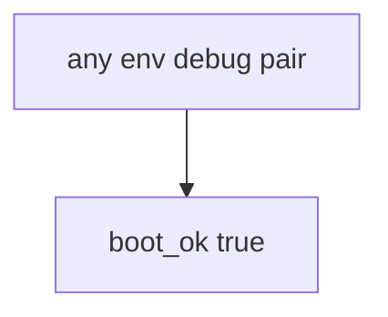

# 10.4-LO-03 — Observe always-true boot_ok, do not attack production

**Kind:** mechanism-lab
**Loop step:** 3 Break
**Standards:** OWASP ASVS 5.0.0 (final) `v5.0.0-13.4.2`. `v5.0.0-13.4.6` version leakage is **Level 3, advanced**. CISA Secure by Design **unverified**. Top 10:2025 A02 is **awareness after** the cause. Lab policy: local only.

## Authorized scope

`labs/10.4/10.4-lab` only. The fixture is an in-process `boot_ok(env, debug)`. Synthetic `env` / `debug` flags. Do **not** enable debug on a real production host, staging SaaS, or someone else’s compose as the exercise.

**Forbidden outcome:** Production process boots with debug enabled. `boot_ok("prod", True)` returns true.

Attacker capability in this lab: anyone who finds an error page or a debug route. That stands in for “we left DEBUG on for five minutes so support can see traces,” `NODE_ENV=production` treated as the conjunction, or a 10% canary treated as hardening. Trust assumption: `boot_ok` is supposed to refuse **prod plus debug**. Compose strings, FastAPI debug defaults, and CISA Secure by Design (unverified) are not in the TCB for this cell.

## Mental model: boot always says yes



The vulnerable tree demonstrates **cause** (fail-open defaults). Do not probe public hosts. Preconditions: `boot_ok` returns true for every pair. You do not need Docker. You must not boot a live host.

ASVS `v5.0.0-13.4.2` wants debug modes disabled in production. Module 5.3 already said secrets stay out of traces (`v5.0.0-13.3.1`); this cell is **the process must not start**. Gate 10 and M4 stay **not-attempted**.

## What to read in the fixture

`vulnerable/cfg.py` returns true for every pair. Tests:

- `test_prod_debug_must_not_boot`
- `test_prod_without_debug_may_boot` — `("prod", False)` may pass on both

You do not need a new flag. The failure of `test_prod_debug_must_not_boot` *is* the evidence.

Do not open the fixed tree yet. Diagnose the cause first.

## Root cause vs impact vs prevention vs detection vs recovery

| Slice | This lab |
|---|---|
| Required property | `boot_ok("prod", True)` is false |
| Root cause | Fail-open defaults; debug ignored |
| Preconditions | `boot_ok` true for every pair |
| Trigger | Anyone who finds `/debug` or an error page |
| Impact | Traces, debugger, secret leak |
| Prevention | Refuse boot when prod and debug |
| Detection | `prod_debug_forbidden`; never trace bodies |
| Recovery | Kill; rotate secrets that appeared in traces |
| Not the lesson | A canary percentage; live compose; Gate 10 complete |

## Framework defaults versus the boot guarantee

FastAPI `debug=True` is a developer default. Next.js will print stack traces when `NODE_ENV` is not production — and the string can lie. Compose will start whatever you wrote. The application guarantee is: **this** fixture, prod plus debug is deny.

## Practice

```text
python3 -m pytest labs/10.4/10.4-lab/tests --impl vulnerable
```

Run from `labs/10.4/10.4-lab` if a repo-root collection picks up `site/`. Record `test_prod_debug_must_not_boot`. Do not probe public hosts. An environment error is not security evidence.

## Transfer

Clinic Django `DEBUG=True`: predict without leaving this directory. Do not hit a live `/debug`.

## Non-goals

No live-production, staging-SaaS, or public debug-endpoint instructions. Do not claim Gate 10. CISA Secure by Design stays unverified. A02 is awareness after the cause, not the syllabus.
