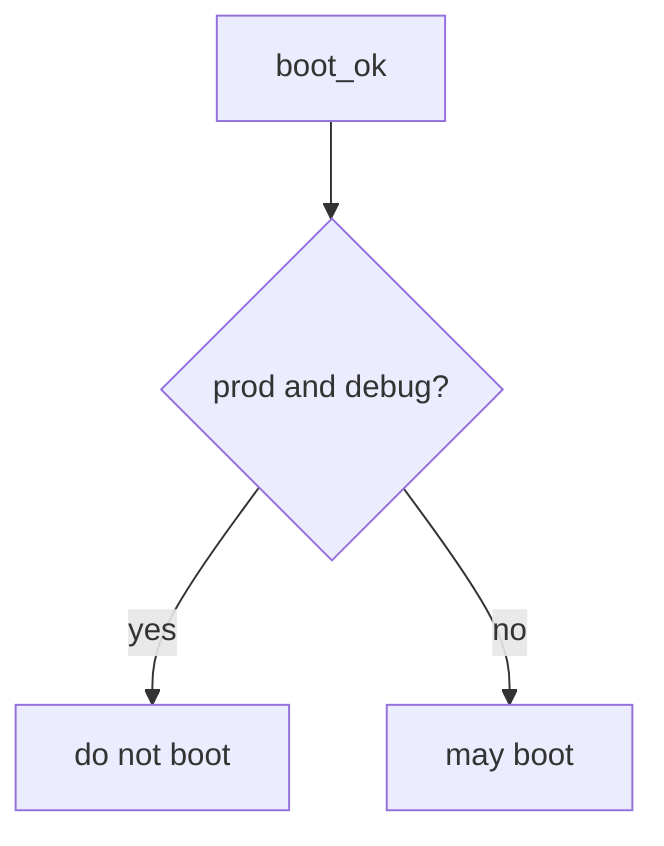

# 10.4-LO-04 — Refuse prod plus debug

**Kind:** design-exercise
**Loop step:** 4 Build
**Standards:** ASVS 5.0.0 (final) `v5.0.0-13.4.2`. Secrets out of traces: `v5.0.0-13.3.1`. `v5.0.0-13.4.6` is **Level 3, advanced**. CISA Secure by Design **unverified**.

## Structural means boot compares env and debug

`boot_ok` must return false when `env == "prod"` and `debug` is true. Fail-safe: production with debug denies. `NODE_ENV` may *accompany* a match; it does not replace it. Structural means that conjunction — not a canary percentage, not IaC file presence, not “we meant to turn it off.”

The smallest restore for SecureCollab’s FastAPI + Next.js compose is: prod + True → do not boot. Do not fail open because support asked for five minutes. Do not register debug routes after a denied boot.

## Mental model: prod and not-debug conjunction



Do not accept “NODE_ENV is production” as the conjunction. Production still needs other flags — a feature flag that disables 1.2 is a sibling grain, not this pytest. `v5.0.0-13.4.5` (management endpoints) and `v5.0.0-13.4.6` (version leakage, Level 3) remain residuals. Emergency debug is E6, not a silent `return True`.

ASVS `v5.0.0-13.4.2` wants debug off in production. This pytest is that sentence for prod+debug.

## Why this restores the cell

| After the fix | Must be true |
|---|---|
| prod + True | boot false |
| prod + False | boot true |

## What this is not

Canary. IaC file presence. CISA Secure by Design (unverified). Gate 10 / M4. Other flags (residual). Top 10:2025 A02 as the syllabus.

## Mechanism limits

- Feature flags that disable authz are not this predicate.
- Sidecar debug (a second process) can still leak.
- `v5.0.0-13.4.6` Level 3 version leakage can remain with debug off.
- Admin bound to all interfaces is a sibling grain (`v5.0.0-13.4.5`).
- Emergency debug needs E6 expiry, not a deleted gate.

## Practice

Name who can edit compose. Run:

```text
python3 -m pytest labs/10.4/10.4-lab/tests --impl fixed
```

Must pass. Run from the lab directory if collection at repo root is polluted.

## Transfer

Django: `DEBUG` must be false when `ENV=prod`, not “we meant to turn it off.”

## Residual risk

Feature flag that disables authz; sidecar debug; `v5.0.0-13.4.6` Level 3; emergency debug with E6.

## Non-goals

Do not boot a live host. Do not claim Gate 10 from a `NODE_ENV` screenshot. Do not present CISA Secure by Design as verified.
