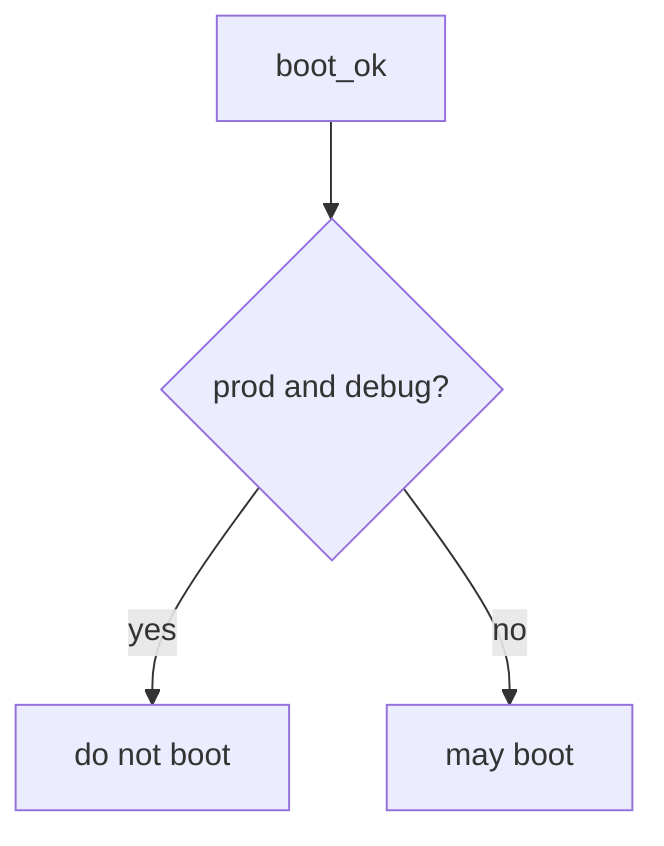

# 10.4-LO-04 — Refuse prod plus debug

**Kind:** design-exercise
**Loop step:** 4 Build
**Standards:** ASVS 5.0.0 (final) `v5.0.0-13.4.2`. Secrets out of traces: `v5.0.0-13.3.1`.

## Structural means boot compares env and debug

`boot_ok` must return false when `env == "prod"` and `debug` is true. Fail-safe: production with debug denies. `NODE_ENV` may *accompany* a match; it does not replace it.

## Mental model: prod and not-debug conjunction



Do not accept “NODE_ENV is production” as the conjunction.

## Why this restores the cell

| After the fix | Must be true |
|---|---|
| prod + True | boot false |
| prod + False | boot true |

## What this is not

Canary. IaC file presence. CISA Secure by Design (unverified). Gate 10 / M4. Other flags (residual).

## Practice

Name who can edit compose. Run:

```
python3 -m pytest labs/10.4/10.4-lab/tests --impl fixed
```

Must pass.

## Transfer

Django: `DEBUG` must be false when `ENV=prod`, not “we meant to turn it off.”

## Residual risk

Feature flag that disables authz; sidecar debug; `v5.0.0-13.4.6` Level 3; emergency debug with E6.
