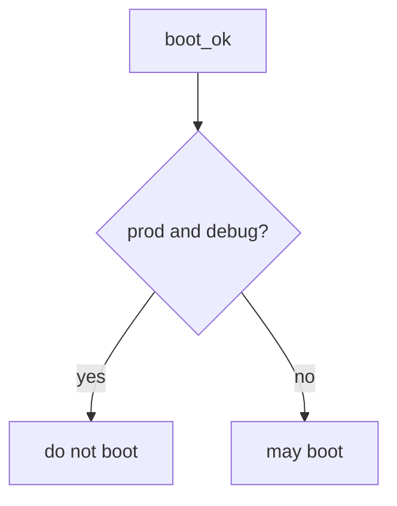

# Refuse prod plus debug

**Kind:** design-exercise
**Loop step:** 4 Build

## The rule

A `NODE_ENV` string does not turn debug off. A canary percentage is a traffic split. “We meant to turn it off” still boots prod-plus-debug.

The repair: `boot_ok` **returns false when `env == "prod"` and `debug` is true**. Production with debug denies. `NODE_ENV` may sit next to a match; it does not replace it. Namely that both-at-once check — not a canary, not an IaC file that exists, not “support asked for five minutes.”

Put this in the notes app’s FastAPI + Next.js compose: prod + True → do not boot. Five minutes for support does not boot debug in prod. Do not register debug routes after a denied boot.

## Picture: prod and debug together



Both flags have to fail together. A production `NODE_ENV` value does not count as the check. A feature flag that turns off authorization (1.2) is leftover, not this debug-off. Docs and monitoring pages that stay public, and extra version leakage with debug already off, remain leftover. Emergency debug is E6, not a silent `return True`.

A checklist that wants debug off in production covers prod plus debug. The check is the local stand-in.

## What the repaired files must show

Do not treat `fixed/cfg.py` as a production compose product.

| After the fix | Must be true |
|---|---|
| prod + True | boot false |
| prod + False | boot true |

If you are unsure whether this boot is production with debug, do not start. Support asking for five minutes does not change that.

## What this is not

- A canary.
- An IaC file that exists.
- A manufacturer-defaults program page we have not verified.
- An assurance-gate sticker.
- Other flags (leftover).
- A famous-bugs list used as the syllabus.
- “We meant to turn it off.”

## What the tool cannot do

- Feature flags that turn off authorization are not this check.
- A sidecar debug process can still leak.
- Extra version leakage can remain with debug off. That is extra, advanced work.
- Admin bound to all interfaces is leftover in the same family (docs and monitoring pages).
- Emergency debug needs an E6 expiry, not a deleted gate.

## Can people still use it

A refused boot must say *prod debug refused* in text, not only “assert False.” Do not encode the reason as color only.

## Practice

Name who can edit compose. Run:

```text
python3 -m pytest labs/10.4/10.4-lab/tests --impl fixed
```

## Use it somewhere new

Django: `DEBUG` must be false when `ENV=prod`, not “we meant to turn it off.”

## What can still go wrong

A feature flag that turns off authorization. Sidecar debug. Extra version leakage with debug already off. Emergency debug without E6.

## What this page is not doing

Do not boot a live host. This page does not mark you as finished. A `NODE_ENV` screenshot is not a check-in. Do not present a manufacturer-defaults program page as verified.
