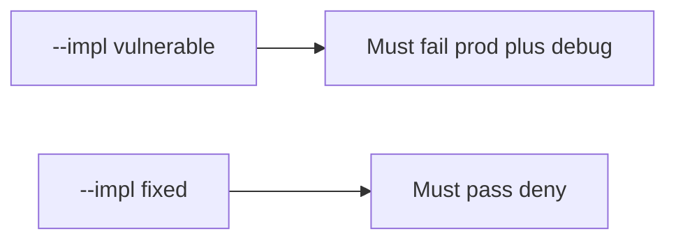

# 10.4-LO-05 — Evidence is prod+debug denied, then a passing pair

**Kind:** verification-lab
**Loop step:** 5 Verify
**Standards:** ASVS `v5.0.0-13.4.2`. CISA Secure by Design **unverified**.

## An invariant that cannot fail a test is still a slogan

“NODE_ENV=production” is not evidence. “Canary 10%” is a mechanism observation. The oracle is: `boot_ok("prod", True)` is false and `("prod", False)` may boot. The prod+debug observation must be **false** on `--impl vulnerable` (returns true) and **true** on `--impl fixed`. Do not boot a live host.

## Mental model: vulnerable must fail: prod plus debug

The failing observation on `--impl vulnerable` is **prod plus debug**. A passing collection count is not this cell.



| Mode | Must show for this module |
|---|---|
| Negative / abuse | prod+debug → not boot; vulnerable must fail |
| Normal | prod without debug → may boot (may pass on both) |
| Not claimed | live compose; canary; Gate 10; other flags |

Lab tests in `labs/10.4/10.4-lab/tests/test_property.py`. `test_prod_debug_must_not_boot` is a **forbidden-outcome** test: always-true `boot_ok` is not allowed to count as a passing control.

```text
python3 -m pytest labs/10.4/10.4-lab/tests --impl vulnerable
python3 -m pytest labs/10.4/10.4-lab/tests --impl fixed
```

Honest prod without debug may pass on both implementations. That does not excuse the prod+debug deny test. If vulnerable does not fail `test_prod_debug_must_not_boot`, the lab is miswired—fix the wiring, not the assertion.

## What the tests do not prove

- Feature flags cannot disable authz
- Admin is not on all interfaces
- Migrations fail closed
- Rollback actually works
- `v5.0.0-13.4.6` Level 3 version leakage is gone
- Gate 10 / M4 complete

Record those as residuals or later modules, not as silent passes.

## Practice

Execute both implementations this session from the lab directory if needed. Write the fail/pass pair next to the matrix row. Reject a “test” that only greps `NODE_ENV` in compose without calling `boot_ok("prod", True)`.

## Transfer

Clinic: a test that only asserts “container started” is not this cell. A live Django host is out of scope.

## Non-goals

Do not add a live-host trophy. Do not log stack traces. Keys stay out of this file. Gate 10 stays not-attempted.
