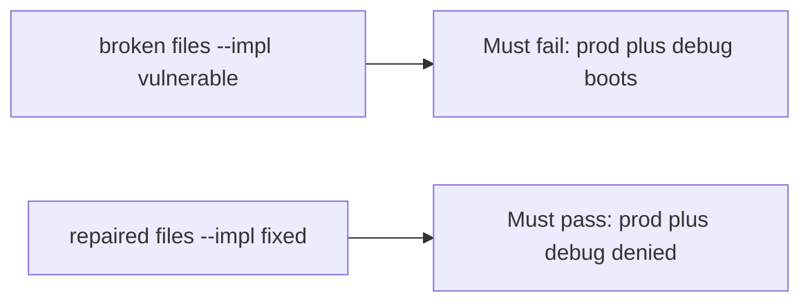

# A broken boot check must fail prod plus debug

**Kind:** verification-lab
**Loop step:** 5 Verify

## Check it

`NODE_ENV=production` does not turn debug off. A 10% canary is a traffic split. `boot_ok("prod", True)` has to be false, and `("prod", False)` may boot. On the broken files prod-plus-debug still boots. On the repaired files it does not. Do not boot a live host.

## Picture: a broken boot check must fail prod plus debug

A passing-test tally can still hide that production still boots with debug.



If both pass, you are not looking at prod plus debug.

## What the check has to show

| Mode | Must show for this topic |
|---|---|
| Normal | prod without debug → may boot (may pass on both) |
| Wrong input | prod plus debug → not boot; broken files must fail |
| Abuse | Unsure flags are not a production boot (fail closed; leftover if not in this check) |
| Not claimed | Live compose; a canary; a check-in; other flags |

The test `test_prod_debug_must_not_boot` is there so always-true `boot_ok` still fails.

Production with debug off may pass on both sides. You still have to deny production with debug on. If the broken files do not fail `test_prod_debug_must_not_boot`, the lab is miswired — fix the wiring, not the assertion.

```text
python3 -m pytest labs/10.4/10.4-lab/tests --impl vulnerable
python3 -m pytest labs/10.4/10.4-lab/tests --impl fixed
```

A `NODE_ENV` string in compose is not `boot_ok("prod", True)`. This practice never opens a live host.

## What the tests do not prove

- Feature flags cannot turn off authorization
- Admin is not on all interfaces
- Migrations fail closed
- Rollback actually works
- Extra version leakage is gone (extra, advanced work)
- That you finished a check-in

## Practice

Call `boot_ok("prod", True)`. A `NODE_ENV` string in compose is the label, not debug-off.

## Use it somewhere new

A container that started is the process, not prod-plus-debug off. Do not use a live Django host.

## What this page is not doing

A live host screenshot is not prod-plus-debug off. Do not log stack traces. Answer keys are not on this site. This page does not finish an assurance check-in.
