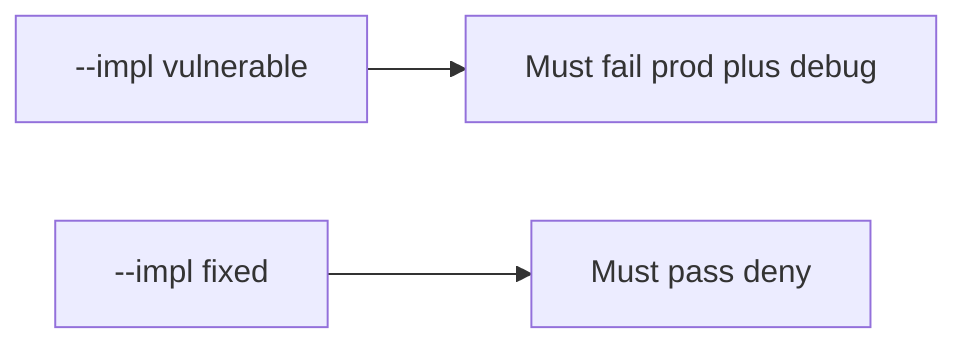

# 10.4-LO-05 — Evidence is prod+debug denied, then a passing pair

**Kind:** verification-lab
**Loop step:** 5 Verify
**Standards:** ASVS `v5.0.0-13.4.2`.

## An invariant that cannot fail a test is still a slogan

“NODE_ENV=production” is not evidence. The oracle is the local pair. Do not boot a live host.

## Mental model: fail-on-vulnerable, pass-on-fixed



| Case | Must show |
|---|---|
| Negative / abuse | prod+debug → not boot |
| Normal | prod without debug → may boot |
| Not claimed | live compose; canary; Gate 10 |

```
python3 -m pytest labs/10.4/10.4-lab/tests --impl vulnerable
python3 -m pytest labs/10.4/10.4-lab/tests --impl fixed
```

Honest prod without debug may pass on both.

## What the tests do not prove

- Feature flags cannot disable authz
- Admin is not on `0.0.0.0`
- Migrations fail closed
- Rollback actually works

## Practice

Execute both implementations. Map each test to an LO-02 cell.

## Transfer

Clinic: a test that only asserts “container started” is not this cell.
