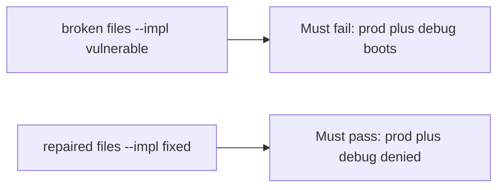

# A broken boot check must fail prod plus debug

**Kind:** verification-lab
**Loop step:** 5 Verify

## Check it

“`NODE_ENV=production`” is not evidence. “Canary 10%” is a tool observation. The check is: `boot_ok("prod", True)` is false and `("prod", False)` may boot. That prod-plus-debug observation must be **false** on the broken files and **true** on the repaired files. Do not boot a live host.

## Picture: a broken boot check must fail prod plus debug

A check that only counts passing tests can still look green while production still boots with debug.



If both pass, the test is not looking at prod plus debug. If both fail, the fix is not structural or the check is wrong.

## What the check has to show

| Mode | Must show for this topic |
|---|---|
| Normal | prod without debug → may boot (may pass on both) |
| Wrong input | prod plus debug → not boot; broken files must fail |
| Abuse | Unsure flags are not a production boot (fail closed; leftover if not in this check) |
| Not claimed | Live compose; a canary; an assurance gate; other flags |

The file is `labs/10.4/10.4-lab/tests/test_property.py`. The test `test_prod_debug_must_not_boot` is there so always-true `boot_ok` cannot sneak through.

Honest prod without debug may pass on both implementations. That does not excuse the prod-plus-debug deny test. If the broken files do not fail `test_prod_debug_must_not_boot`, the lab is miswired — fix the wiring, not the assertion.

```text
python3 -m pytest labs/10.4/10.4-lab/tests --impl vulnerable
python3 -m pytest labs/10.4/10.4-lab/tests --impl fixed
```

A test that only greps `NODE_ENV` in compose without calling `boot_ok("prod", True)` is not this topic’s evidence. This practice never opens a live host.

## What the tests do not prove

- Feature flags cannot turn off authorization
- Admin is not on all interfaces
- Migrations fail closed
- Rollback actually works
- Extra version leakage is gone (extra, advanced work)
- An assurance gate is complete

Record those as leftover or later topics, not as silent passes.

## Practice

Run both this session from the lab directory if needed:

```text
python3 -m pytest labs/10.4/10.4-lab/tests --impl vulnerable
python3 -m pytest labs/10.4/10.4-lab/tests --impl fixed
```

Paste nothing from answer keys. Write fail/pass into your notes next to the matrix row. Reject a “test” that only greps `NODE_ENV` in compose without calling `boot_ok("prod", True)`.

## Use it somewhere new

A clinic example: a test that only asserts “container started” is not this topic. A live Django host is out of scope.

## What this page is not doing

Do not treat a live host screenshot as proof. Do not log stack traces. Answer keys are not on this site. The assurance gate stays not finished.
