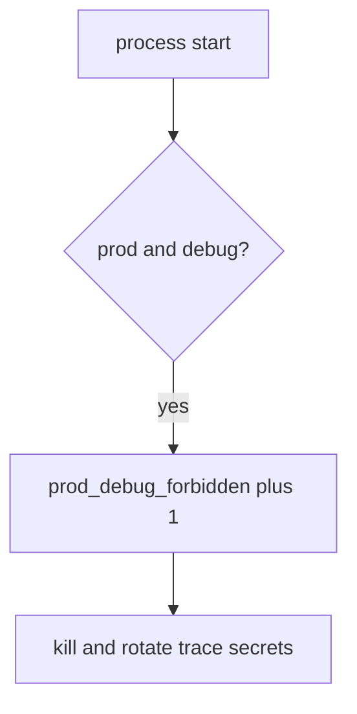

# Turn debug off without leaking logs

**Kind:** operations-exercise
**Loop step:** 6 Operate

## Fixing it once is not enough

Production can still boot with debug on. Do not paste secret-bearing stack traces or the traceback.

## Picture: an illegal boot is a signal

If production boots with debug on, page env, debug, and deploy — not the stack trace. Then kill the process and rotate secrets that already leaked.



A canary product does not keep debug off in production.

Debug on in prod still has to refuse boot in `test_prod_debug_must_not_boot`. A green `NODE_ENV` tile does not keep debug off. Emergency debug is E6 — do not call production safe until that exception is on the register.

## Signals that do not become a second leak

| Outcome | This topic |
|---|---|
| Notice | `prod_debug_forbidden` |
| What the line holds | env, debug, deploy id; **never** trace bodies |
| Respond | Stop the process that booted with debug; do not paste traces into chat |
| Recover | Kill; rotate secrets that appeared in traces |
| Leftover | Other flags; E6 emergency debug; sidecar debug |

A canary dashboard will show rollout percent and stay silent when CI’s `boot_ok` is always true. Detection must observe **prod plus debug is deny**, not “the container started.” A stack trace or a session token on that canary page is the same leak as a log line.

```text
log_denied reason=prod_debug_forbidden env=prod debug=true deploy=sc-12
```

Stack traces, secrets, and “check-in complete” turn the sample into another incident dump.

The boot-deny ticket needs the env name. The stack belongs in the lab folder.

## What the framework does vs what you still have to check

Feature flags, sidecar debug, and a public admin bind still boot even if the canary dashboard is green.

Fail-open boot (debug ignored) caused this. Traces and extra attack surface is the bill. Stop it with the prod-and-debug check. Notice `prod_debug_forbidden`. Recover: kill-and-rotate. A green dashboard does not catch a feature flag that turns off authorization (1.2), and it does not catch sidecar debug.

## Can people still use it

A refused boot must say *prod debug refused*, not only “assert False.” Do not encode that reason as color only.

## Practice

```text
log_denied reason=prod_debug_forbidden env=prod debug=true deploy=sc-12
```

Prod-debug denials name env and a reason. A stack, a secret, or “check-in complete” is a second boot dump.

## Use it somewhere new

Deny Django `DEBUG=True`; do not paste the traceback into the ticket. Do not hit a live `/debug`.

## What this page is not doing

A canary sticker does not keep debug off. This page does not mark you as finished. A manufacturer-defaults program page stays unverified. Answer keys are not on this site.
