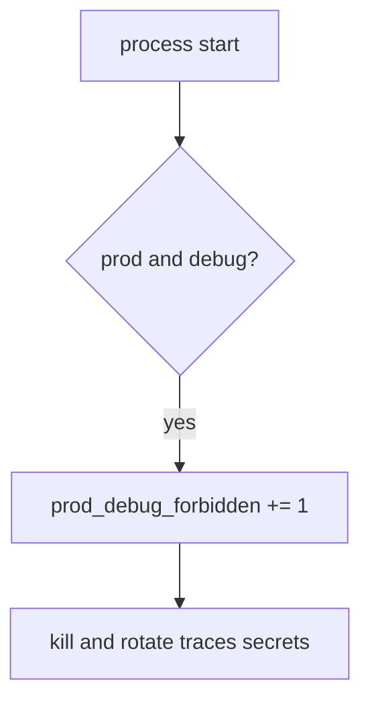

# 10.4-LO-06 — Detect prod_debug_forbidden without logging traces

**Kind:** operations-exercise
**Loop step:** 6 Operate
**Standards:** NIST CSF 2.0 (final) DE/RS/RC as outcome labels; ASVS `v5.0.0-13.4.2`, `v5.0.0-13.3.1`.

## Prevention is not absolute

A flag can flip after boot. Pair detect and recover. Do not log stack traces that contain secrets, session tokens, or note bodies (3.1 / 5.3).

## Mental model: illegal boot is a signal



| Outcome | This module |
|---|---|
| Detect | `prod_debug_forbidden` |
| Signal | env, debug, deploy id; never trace bodies |
| Recover | Kill; rotate secrets that appeared in traces |
| Residual | Other flags; E6 emergency debug |

## Practice

Write one log line you would accept. Tie it to `labs/10.4/10.4-lab`.

```
log_denied reason=prod_debug_forbidden env=prod debug=true deploy=sc-12
```

Reject any line that includes a stack trace, a secret, or “Gate 10 complete.”

## Transfer

Clinic: deny Django `DEBUG=True`; do not paste the traceback into the ticket.

## Non-goals

A canary-vendor name is not the property. M4 stays not-attempted.
