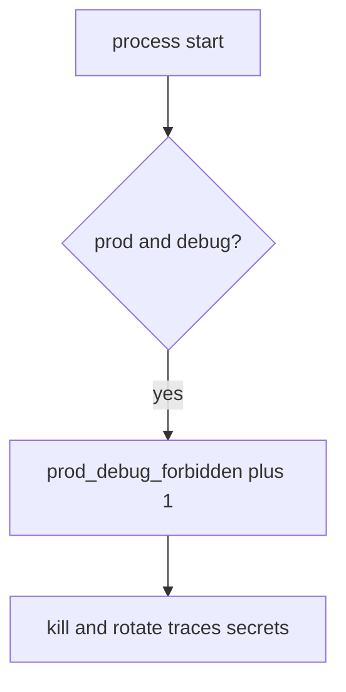

# 10.4-LO-06 — Detect prod_debug_forbidden without logging traces

**Kind:** operations-exercise
**Loop step:** 6 Operate
**Standards:** NIST CSF 2.0 (final) DE/RS/RC as outcome labels; ASVS `v5.0.0-13.4.2`, `v5.0.0-13.3.1`.

## Prevention is not absolute

A flag can flip after boot. Pair detect and recover. Do not log stack traces that contain secrets, session tokens, or note bodies (3.1 / 5.3). Do not paste the traceback into the ticket.

## Mental model: illegal boot is a signal



| Outcome | This module |
|---|---|
| Detect | `prod_debug_forbidden` |
| Signal | env, debug, deploy id; never trace bodies |
| Recover | Kill; rotate secrets that appeared in traces |
| Residual | Other flags; E6 emergency debug; sidecar debug |

CSF 2.0 Detect / Respond / Recover name outcomes. They do not prove `v5.0.0-13.4.2`. A canary-product name is not the property. Re-run `test_prod_debug_must_not_boot` after any compose change; a green `NODE_ENV` tile is not that pytest. Emergency debug is E6 — inventory it before claiming Recover.

## Framework defaults versus the operate guarantee

A canary dashboard will show rollout percent and stay silent when CI’s `boot_ok` is always true. Detection must observe **prod plus debug is deny**, not “the container started.” If the alert includes a stack trace or a session token, you have opened a 3.1 / 5.3 / `v5.0.0-13.3.1` cell.

## Practice

Write one log line you would accept. Tie it to `labs/10.4/10.4-lab`.

```text
log_denied reason=prod_debug_forbidden env=prod debug=true deploy=sc-12
```

Reject any line that includes a stack trace, a secret, or “Gate 10 complete.”

## Transfer

Clinic: deny Django `DEBUG=True`; do not paste the traceback into the ticket. Do not hit a live `/debug`.

## Usability

A refused boot must say *prod debug refused*, not only “assert False” (WCAG 2.2 Success Criterion 4.1.3 for human-read CI).

Cause vs impact stays split here too: the **cause** is fail-open boot (debug ignored); the **impact** is traces and extra attack surface; **prevention** is the conjunction; **detection** is `prod_debug_forbidden`; **recovery** is kill-and-rotate. Mechanism limit: this alert does not catch a feature flag that disables 1.2, and it does not catch sidecar debug.

## Non-goals

A canary-vendor name is not the property. M4 stays not-attempted. CISA Secure by Design stays unverified.
