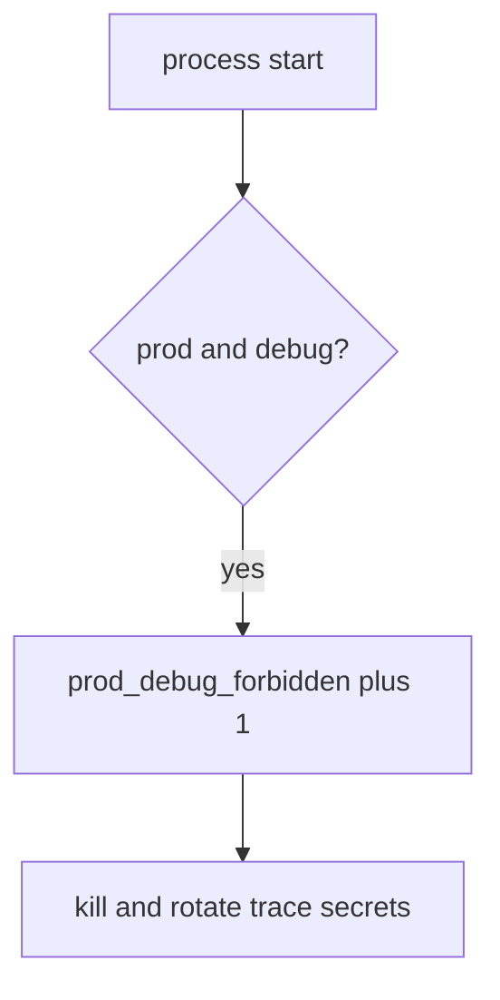

# Turn debug off without leaking logs

**Kind:** operations-exercise
**Loop step:** 6 Operate

## Fixing it once is not enough

A flag can still flip after `boot_ok` was repaired once. Do not log stack traces that contain secrets, session tokens, or note bodies. Leave the traceback out of the ticket.

## Picture: an illegal boot is a signal

If production boots with debug on, page env, debug, and deploy — not the stack trace. Then kill the process and rotate secrets that already leaked.



A canary product does not keep debug off in production. A tile that says boot was refused is not that check.

Re-run `test_prod_debug_must_not_boot` after any compose change. A green `NODE_ENV` tile does not keep debug off. Emergency debug is E6 — do not call production safe until that exception is on the register.

## Signals that do not become a second leak

| Outcome | This topic |
|---|---|
| Notice | `prod_debug_forbidden` |
| What the line holds | env, debug, deploy id; **never** trace bodies |
| Respond | Stop the process that booted with debug; do not paste traces into chat |
| Recover | Kill; rotate secrets that appeared in traces |
| Leftover | Other flags; E6 emergency debug; sidecar debug |

A canary dashboard will show rollout percent and stay silent when CI’s `boot_ok` is always true. Detection must observe **prod plus debug is deny**, not “the container started.” If the alert includes a stack trace or a session token, you have opened the same leak as a log line.

```text
log_denied reason=prod_debug_forbidden env=prod debug=true deploy=sc-12
```

Not: a stack trace, a secret, or “assurance gate complete.”

Putting the matching trace in the alert puts the stack in the pager too.

## What the framework does vs what you still have to check

The same feature flags, sidecar debug, and public admin bind that bypass this practice will also bypass a “scan our canary dashboard” detector.

The **cause** is fail-open boot (debug ignored); the **cost** is traces and extra attack surface; **how you stop it** is the prod-and-debug check; **how you notice** is `prod_debug_forbidden`; **how you recover** is kill-and-rotate. What the tool cannot do: this alert does not catch a feature flag that turns off authorization (1.2), and it does not catch sidecar debug.

## Can people still use it

A refused boot must say *prod debug refused*, not only “assert False.” Do not encode that reason as color only.

## Practice

```text
log_denied reason=prod_debug_forbidden env=prod debug=true deploy=sc-12
```

Reject any line that includes a stack trace, a secret, or “assurance gate complete.”

## Use it somewhere new

Deny Django `DEBUG=True`; do not paste the traceback into the ticket. Do not hit a live `/debug`.

## What this page is not doing

A canary-vendor name is not the rule. This page does not mark you as finished. A manufacturer-defaults program page stays unverified. Answer keys are not on this site.
