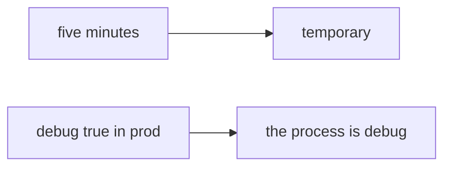

# Same idea on a clinic Django app with DEBUG=True

**Kind:** transfer-challenge
**Loop step:** 7 Transfer

## Use it somewhere new

You get a **clinic Django `DEBUG=True`**.

On the notes app, `boot_ok("prod", True)` must be false. For a clinic, prod plus debug denied, prod without debug may boot. Setting `NODE_ENV` without comparing `env` to `debug` still leaves `boot_ok("prod", True)` true.

**Product sketch:** an EHR-lite “we left DEBUG on for five minutes so support can see traces,” plus “`NODE_ENV` is production and we canary 10%.”

## Picture: five minutes vs a boot

Calling it “chart” instead of “note” does not move the work. Env, debug, and leftover change. Leaving DEBUG on for five minutes is still a production boot.

| Notes app this week | Clinic sketch |
|---|---|
| Production must not boot with debug | Clinic Django must not run with `DEBUG=True` |
| `boot_ok("prod", True)` is false | Same call on **local** practice files |
| Anyone who finds `/debug` | Same actor — **not** a live clinic |
| `NODE_ENV` / canary / IaC file | Same slogans — not the check |
| Feature flag that turns off authz | Same leftover family |

If support asked for five minutes while `boot_ok` is always true, the rule is gone. `NODE_ENV`, a canary, and an IaC file do not compare `env` to `debug`. A feature flag that turns off authorization is the same fail-open family — name it, do not hit a live `/debug` here. A famous-bugs list is a label *after* the fail-open cause, not this week’s rule. A manufacturer-defaults program page stays unverified. Extra version leakage can remain with debug off — extra, advanced work.

Prod plus debug still has to be denied. Prod without debug may still boot. Setting `NODE_ENV` without that both-at-once check leaves `boot_ok("prod", True)` true. The local check is `test_prod_debug_must_not_boot` — on a practice, not a live host.

## Write this for a clinic Django DEBUG=True

1. who can act (anyone who finds `/debug` or an error page — not a live clinic);
2. what you trust (prod plus debug deny is the promise; `NODE_ENV`, a canary, and IaC are not);
3. what must not happen (`boot_ok("prod", True)` true);
4. a test idea on **local** practice files only (no live Django);
5. leftover (other flags, sidecar debug, extra version leakage, E6 emergency debug);
6. whether engineers read the refused boot (say *prod debug refused*, not color only).

Use fake labels. Do not use real patient names.

Also name a feature flag that turns off authorization.

## What is not good enough

| Reject | Why |
|---|---|
| “`NODE_ENV` is production” | String, not the both-at-once check |
| Live Django / public `/debug` tutorial | Course rules |
| A famous-bugs list as “then 1.2 is done” | Awareness after the cause |
| “canary 10%” | Rollout, not `boot_ok` |
| “assurance gate complete” | Forbidden stamp |

## Practice

One page. No answer keys. `labs/10.4/10.4-lab` is the only running system you may break. Do not boot a live host.

## What this page is not doing

Do not run live-production attacks. Do not follow public debug-endpoint walkthroughs. This page does not finish an assurance gate.
