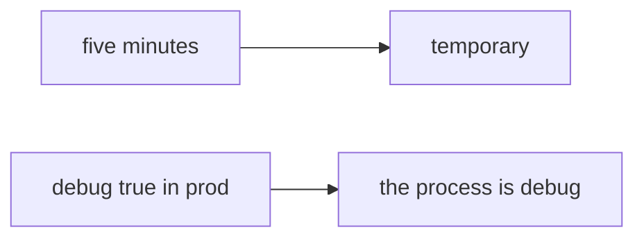

# 10.4-LO-07 — Transfer: clinic Django DEBUG=True

**Kind:** transfer-challenge
**Loop step:** 7 Transfer
**Standards:** ASVS `v5.0.0-13.4.2`. CISA Secure by Design **unverified**. Top 10:2025 A02 awareness after the cause.

## Change the workplace; keep NODE_ENV from meaning debug-off

Do not answer with a Top 10 / CWE / scanner as the definition of security.

**Prompt:** Clinic: Django `DEBUG=True`. Also name a feature flag that disables authz.

**Product sketch:** EHR-lite “we left DEBUG on for five minutes so support can see traces,” plus “NODE_ENV is production and we canary 10%.”

Rewrite the SecureCollab sentence. Include:

1. attacker capabilities (anyone who finds `/debug` or an error page — not a live clinic host attack);
2. trust assumptions (prod+debug deny is TCB; NODE_ENV/canary/IaC are not);
3. forbidden outcome (`boot_ok("prod", True)` true, not “HIPAA”);
4. a test idea on a **local** fixture only (no live Django);
5. residual (other flags, sidecar debug, `v5.0.0-13.4.6` Level 3, E6 emergency debug);
6. WCAG if boot is human-read (say prod debug refused).

## Mental model: five minutes vs a boot

## What graders reject

| Reject | Why |
|---|---|
| “NODE_ENV is production” | String, not the conjunction |
| Live Django / public `/debug` tutorial | Lab policy |
| “A02 so 1.2 is done” | Awareness after the cause |

## Practice

One page. No keys. `labs/10.4/10.4-lab` is the only running system you may break.
