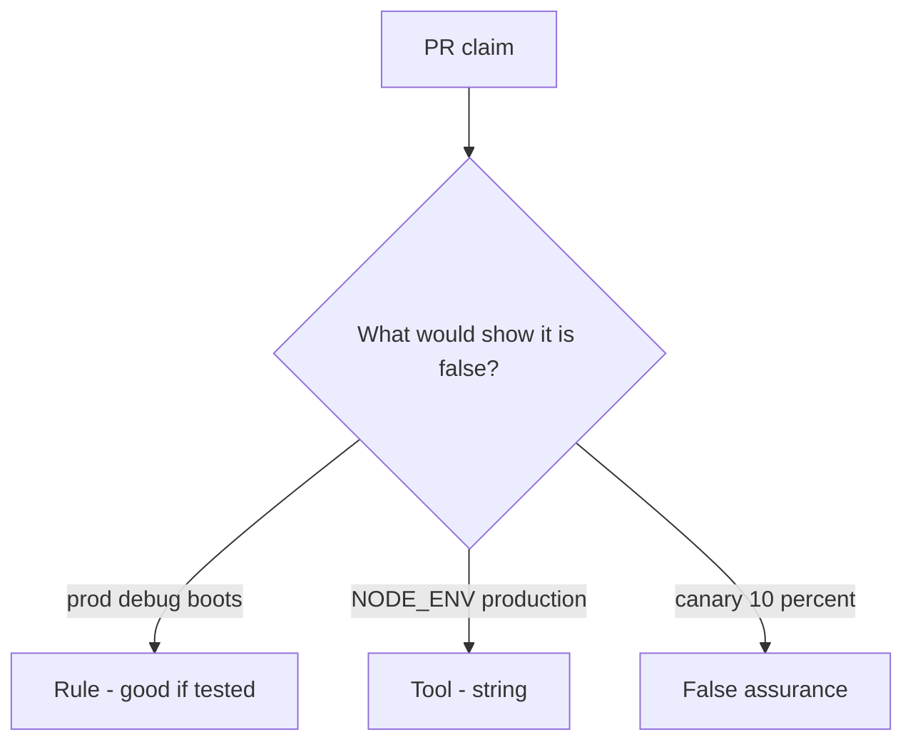

# Would you merge this always-true boot_ok?

**Kind:** code-review
**Loop step:** Review

## What you are reviewing

The files in `labs/10.4/10.4-lab/vulnerable/` are the boot-check change. Does `boot_ok("prod", True)` still return true?

Open `boot_ok` and the prod-plus-debug pair. A `NODE_ENV` screenshot is the wrong starting place. Writing “will turn debug off later” does not make `test_prod_debug_must_not_boot` pass.

## Picture: boot_ok true on prod plus debug

**`boot_ok` true on prod plus debug**.

Prod plus debug still has to be denied. If the change never checks both at once, that always-boot path is still open. A `NODE_ENV` screenshot does not replace that check.

Feature flags are leftover you still have to trust. Admin bound to all interfaces is leftover in the same family (docs and monitoring pages). This page does not mark you as finished. Do not boot a live host to prove the finding.

## Problems to find (name them yourself)

- `boot_ok` true on prod plus debug
- Admin on all interfaces
- Migration fail-open
- No rollback drill

Also reject: live production attacks; booting without re-running `test_prod_debug_must_not_boot`; keys in learner notes; treating this debug-off lesson as a check-in; treating a manufacturer-defaults program page as verified.

## Common mix-ups

- IaC means hardened
- Canary equals secure config
- Feature flags are not something you trust
- `NODE_ENV` is `boot_ok`
- A known-exploited list is the boot check

## Use it somewhere new

`NODE_ENV` plus a canary, without a prod-plus-debug deny, do not finish the boot gate. `NODE_ENV` is not a prod-plus-debug deny — write the boot refuse.

## Can people still use it

A refused boot must say *prod debug refused*, not only “will turn debug off later.”

## What this page is not doing

Do not ship production-plus-debug because a comment promises to turn debug off later. Do not hit a public debug endpoint to prove the finding.
