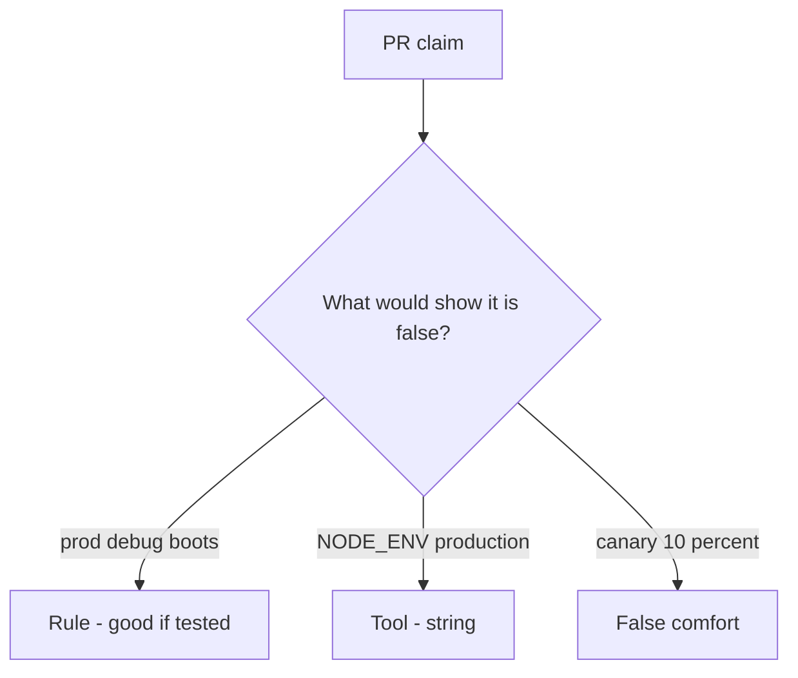

# Review always-true boot_ok like a pull request

**Kind:** code-review
**Loop step:** Review

Intended findings live only in the answer-key folder — not here. Do not open that file until your review has been evaluated.

## What you are reviewing

A colleague ships the notes app’s compose boot check. Review `labs/10.4/10.4-lab/vulnerable/` as that change. Your job is not to count suspicious lines. Reconstruct whether `boot_ok("prod", True)` still returns true, compare that with the rule, and write changes a developer can verify.

Start at `boot_ok` and the prod-plus-debug pair, not at a scanner color or a `NODE_ENV` screenshot. The check you already ran (`test_prod_debug_must_not_boot`) is the rule test. A comment “will turn debug off later” is not.

## Picture: boot_ok true on prod plus debug

Start with this seeded smell: **`boot_ok` true on prod plus debug**. Label it rule, tool, or false comfort before you accept the change.

Start from what must stay true (prod plus debug denied). Everything that is not the both-at-once check at that call is a candidate always-boot path. A `NODE_ENV` screenshot without that check is the same problem, not a different kind of finding.

Feature flags are leftover you still have to trust. Admin bound to all interfaces is leftover in the same family (docs and monitoring pages). Do not skip `test_prod_debug_must_not_boot`. This page does not mark you as finished. Do not boot a live host to prove the finding.

## Seeded smells (label them yourself)

- `boot_ok` true on prod plus debug
- Admin on all interfaces
- Migration fail-open
- No rollback drill

Also reject: live production attacks; booting without re-running `test_prod_debug_must_not_boot`; keys in learner notes; claiming an assurance gate; treating a manufacturer-defaults program page as verified.

## Common mix-ups

- IaC means hardened
- Canary equals secure config
- Feature flags are not something you trust
- `NODE_ENV` is `boot_ok`
- A famous-bugs list is this week’s rule

## Practice

Write three review notes a maintainer could act on. Each note: what you saw, rule or false comfort, suggested structural change, leftover you will **not** delete. Tie at least one note to `test_prod_debug_must_not_boot`. Do not open the keys file.

## Use it somewhere new

Clinic change that “set `NODE_ENV` and added a canary” without a prod-plus-debug deny is an incomplete boot-gate review. Name the independent falsehood that would still keep prod plus debug from booting.

## Can people still use it

A refused boot must say *prod debug refused*, not only “will turn debug off later.”

## What this page is not doing

Do not merge by adding a comment “will turn debug off later.” That comment is leftover without an owner. Do not hit a public debug endpoint to prove the finding.
