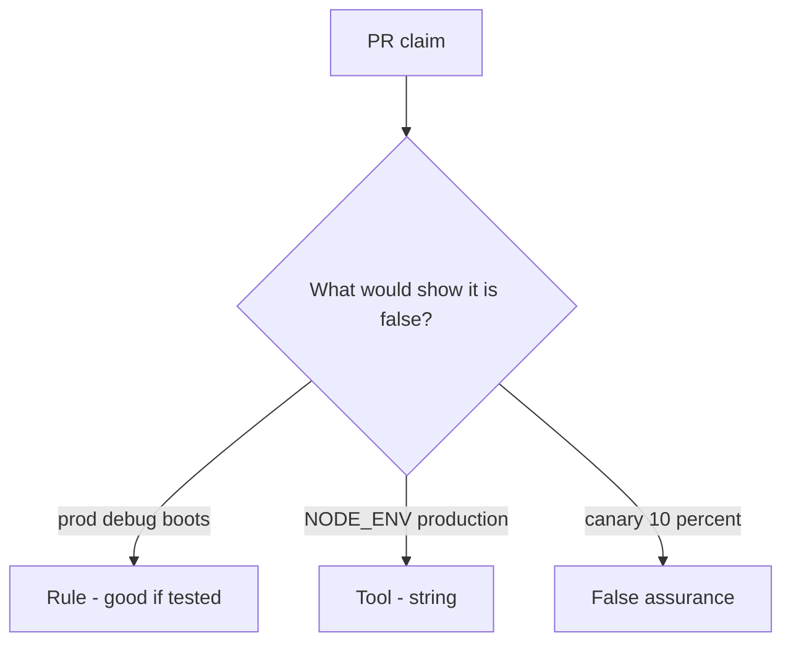

# Would you merge this always-true boot_ok?

**Kind:** code-review
**Loop step:** Review

Wait until someone has looked at your review before opening the keys.

## What you are reviewing

Review `labs/10.4/10.4-lab/vulnerable/` as a change to the notes app’s compose boot check. Check whether `boot_ok("prod", True)` still returns true.

Start at `boot_ok` and the prod-plus-debug pair, not at a scanner color or a `NODE_ENV` screenshot. The check you already ran (`test_prod_debug_must_not_boot`) is the rule test. A comment “will turn debug off later” is not.

## Picture: boot_ok true on prod plus debug

**`boot_ok` true on prod plus debug**.

Prod plus debug still has to be denied. If the change never checks both at once, that always-boot path is still open. A `NODE_ENV` screenshot does not replace that check.

Feature flags are leftover you still have to trust. Admin bound to all interfaces is leftover in the same family (docs and monitoring pages). Do not skip `test_prod_debug_must_not_boot`. This page does not mark you as finished. Do not boot a live host to prove the finding.

## Problems to find (name them yourself)

- `boot_ok` true on prod plus debug
- Admin on all interfaces
- Migration fail-open
- No rollback drill

Also reject: live production attacks; booting without re-running `test_prod_debug_must_not_boot`; keys in learner notes; claiming an assurance gate; treating a manufacturer-defaults program page as verified.

## Common mix-ups

- IaC means hardened
- Canary equals secure config
- Feature flags are not something you trust
- `NODE_ENV` is `boot_ok`
- A famous-bugs list is this week’s rule

## Practice

Write the review that blocks this change. Mention `test_prod_debug_must_not_boot`.

## Use it somewhere new

Clinic change that “set `NODE_ENV` and added a canary” without a prod-plus-debug deny is an incomplete boot-gate review. Name the independent falsehood that would still keep prod plus debug from booting.

## Can people still use it

A refused boot must say *prod debug refused*, not only “will turn debug off later.”

## What this page is not doing

Do not merge by adding a comment “will turn debug off later.” That comment is leftover without an owner. Do not hit a public debug endpoint to prove the finding.
