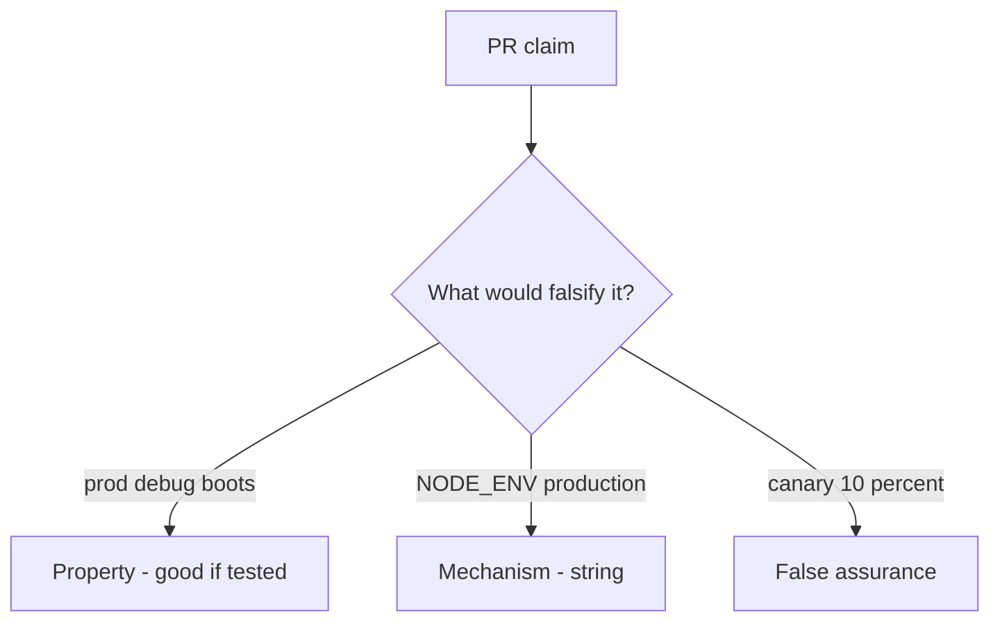

# 10.4-LO-08 — Review always-true boot_ok as a PR

**Kind:** code-review
**Loop step:** Review
**Standards:** ASVS `v5.0.0-13.4.2`, `v5.0.0-13.4.5`, `v5.0.0-13.3.1`. CISA Secure by Design **unverified**.

## Review the fixture as if it were SecureCollab compose

Review `labs/10.4/10.4-lab/vulnerable/` as a SecureCollab PR. Your job is not to count suspicious lines. Reconstruct whether `boot_ok("prod", True)` still returns true, compare that with the module invariant, and write changes a developer can verify.

Intended findings live only in `content/assessment/keys/10.4.md` — not here. Do not open the keys file until your review has been evaluated.

## Mental model: boot_ok true on prod+debug

Start with this seeded smell: **`boot_ok` true on prod+debug**. Label it property, mechanism, or false assurance before you accept the PR.

Classification starts at the protected effect (prod+debug denied). Everything that is not the conjunction at that call is a candidate always-boot path. A `NODE_ENV` screenshot without that pytest is the same smell, not a different finding class.

Feature flags are sibling TCB. Admin bind-all is `v5.0.0-13.4.5`. Do not skip `test_prod_debug_must_not_boot`. Do not claim Gate 10. Do not boot a live host to prove the finding.

## Seeded smells (label them yourself)

- `boot_ok` true on prod+debug
- Admin on all interfaces
- Migration fail-open
- No rollback drill

Also reject: live production attacks; booting without re-running `test_prod_debug_must_not_boot`; keys in lessons; claiming Gate 10 or M4; treating CISA Secure by Design as verified.

## Misconceptions this module refuses

- IaC means hardened
- Canary equals secure config
- Feature flags are not TCB
- `NODE_ENV` is `boot_ok`
- Top 10:2025 A02 is the syllabus

## Practice

Write three review notes a maintainer could act on. Each note: observation, property or false assurance, suggested structural change, residual you will **not** delete. Tie at least one to `test_prod_debug_must_not_boot`.

## Transfer

Clinic PR that “set NODE_ENV and added a canary” without a prod+debug deny is an incomplete boot-gate review. Name the independent falsehood that would still keep prod+debug from booting.

## Non-goals

Do not merge by adding a comment “will turn debug off later.” That comment is a residual without an owner. Do not hit a public debug endpoint to prove the finding.
