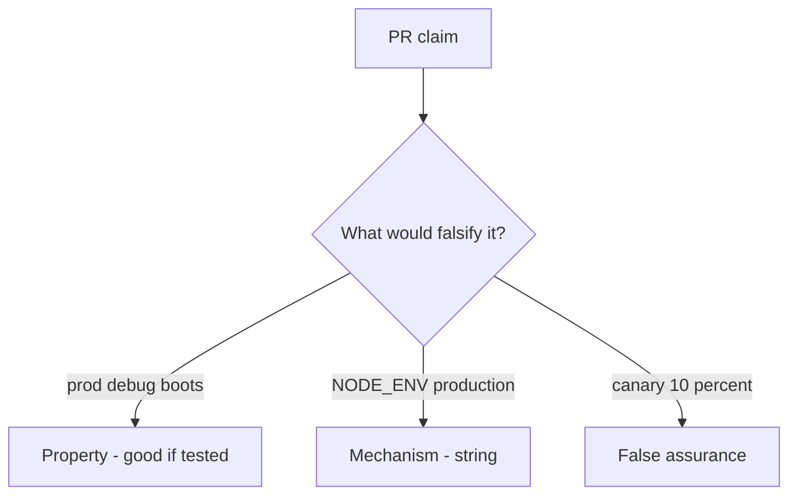

# 10.4-LO-08 — Review always-true boot_ok as a PR

**Kind:** code-review
**Loop step:** Review
**Standards:** ASVS `v5.0.0-13.4.2`, `v5.0.0-13.4.5`, `v5.0.0-13.3.1`.

## Review the fixture as if it were SecureCollab compose

Review `labs/10.4/10.4-lab/vulnerable/` as a SecureCollab PR. Intended findings live only in `content/assessment/keys/10.4.md` — not here.

## Mental model: property, mechanism, or false assurance

Seeded smells (label them yourself; do not open the keys file):

- `boot_ok` true on prod+debug
- Admin on `0.0.0.0`
- Migration fail-open
- No rollback drill

Also reject: live production attacks, keys in lessons, claiming Gate 10 or M4.

## Misconceptions

- IaC means hardened
- Canary equals secure config
- Feature flags are not TCB

## Practice

Write three review notes. Tie at least one to `test_prod_debug_must_not_boot`.

## Transfer

Clinic PR that “set NODE_ENV and added a canary” without a prod+debug deny is incomplete.
