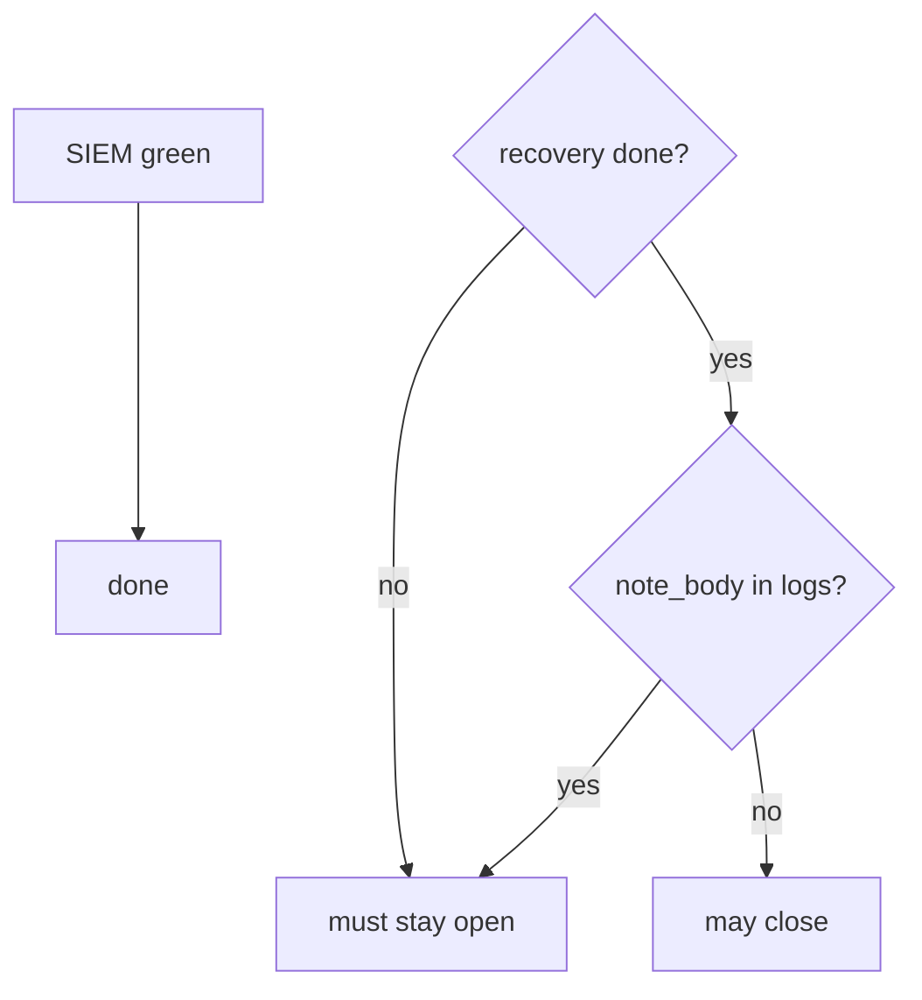
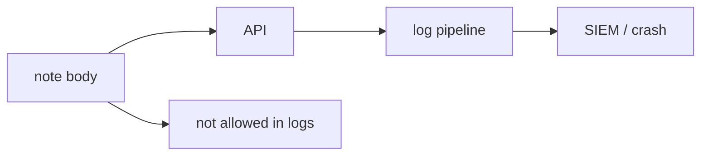

# 10.5-LO-01 — A green SIEM is not recovery

**Kind:** concept-model
**Loop step:** 1 Property
**Standards:** ASVS `v5.0.0-16.1.1`, `v5.0.0-16.2.5`, `v5.0.0-16.4.2`, `v5.0.0-16.4.3`; the L3 clause of `v5.0.0-16.3.2` is **Level 3, advanced**. NIST CSF 2.0 DE/RS/RC as outcome labels. CISA KEV is **awareness**. OWASP Logging Cheat Sheet as vocabulary.

## The claim this module owns

SecureCollab’s incident ticket has a `recovery` field and a `logs` blob. **Resilience after prevention failed** is whether you can close only when recovery is done *and* logs are not a second note store. A green SIEM, PagerDuty ack, or KEV listing is not that check.

> `close_incident({"recovery": "todo", "logs": "ok"})` must be false. `close_incident({"recovery": "done", "logs": "note_body leaked"})` must be false. Honest recovery + safe logs may close.

The forbidden outcomes are **incident closed without recovery evidence** and **note body in logs**. Detect without recover is theater. Logs with bodies are 3.1 / 5.1 / 8.5 at the observability sink.

ASVS `v5.0.0-16.1.1` wants a logging inventory. `v5.0.0-16.2.5` wants logging by protection level — note bodies are not “forensics.” `v5.0.0-16.4.2` / `v5.0.0-16.4.3` want logs protected and shipped to a logically separate system so a breach of the app does not erase evidence. The L3 clause of `v5.0.0-16.3.2` (log *all* authorization decisions without the sensitive data) is **Level 3, advanced**. NIST CSF 2.0 Recover is an outcome, not a product. KEV is patch-priority input (9.5 spiral), not close.

## Mental model: detect vs recover



## Mental model: logs are a sink



**Mechanism (not the property):** PagerDuty, a SIEM dashboard, MTTD, “we have backups,” KEV.

## Root cause vs impact vs prevention vs detection vs recovery

| Slice | For this property |
|---|---|
| Root cause | Close on detection quality |
| Preconditions | `close_incident` true while recovery is todo |
| Trigger | Optimistic closer; still-in attacker |
| Impact | System still broken or attacker still in; extra note copies |
| Prevention | Require recovery evidence; omit bodies |
| Detection | `incident_closed_without_recovery` |
| Recovery | This *is* the step — restore drill |

## Framework defaults versus the close guarantee

A SIEM will go green when the *rule* stops firing. That is not a restore test. Untested backups are not Recover. Support tools with cluster-admin (10.3) are a second incident.

## Mechanism limits

- Observability pipeline as exfil (3.1).
- Mark recovery N/A without E6.
- Some incidents never get perfect forensic certainty — say so.
- KEV listing is not authorization to scan public systems.

## Usability and accessibility

IR runbooks and status pages must be usable under stress (keyboard, language, not color-only severity) (WCAG 2.2).

## Practice

Name the restore evidence you would accept. Then run:

```
python3 -m pytest labs/10.5/10.5-lab/tests --impl vulnerable
python3 -m pytest labs/10.5/10.5-lab/tests --impl fixed
```

The first command must fail. The second must pass.

## Transfer

Ransomware restore vs note-level integrity. Clinic: close ticket when SIEM is green.

## Non-goals

Live IR systems, claiming Gate 10 or M4. Answer keys are not in this file.
