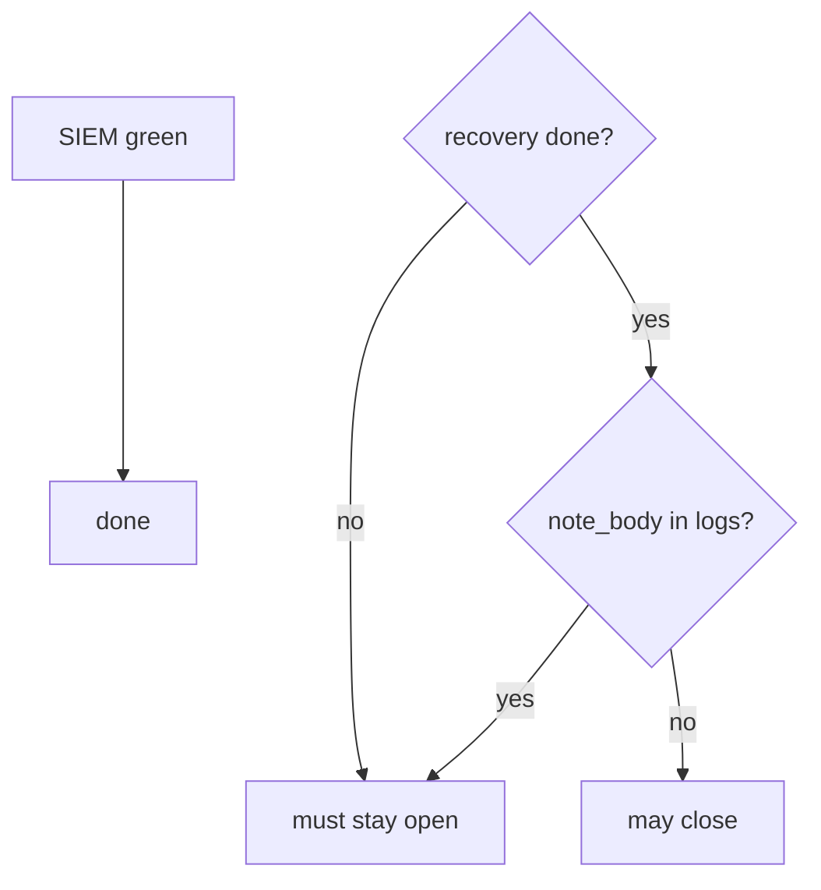
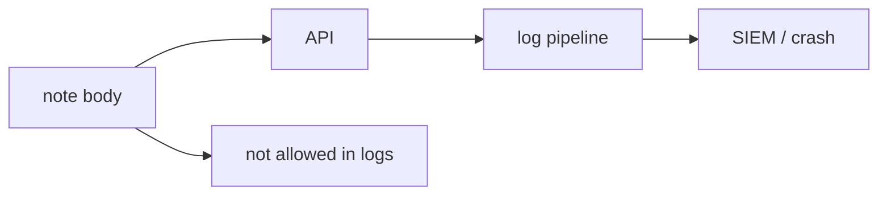

# A green SIEM is not recovery

**Kind:** concept-model
**Loop step:** 1 Property

## The rule

The notes app may get an incident ticket with a `recovery` field and a `logs` blob. Closing that ticket needs **recovery actually done** *and* logs that are not a second copy of the note. A green SIEM tile, a paging ack, or a known-exploited listing is not that check.

> `close_incident({"recovery": "todo", "logs": "ok"})` must be false. `close_incident({"recovery": "done", "logs": "note_body leaked"})` must be false. Honest recovery plus safe logs may close.

So what must not happen: **an incident closed without recovery evidence**, and **a note body in the logs**. Detect without recover is theater. Logs with bodies are leftover copies at the observability sink — the same family as earlier lessons on note bodies, extra copies, and crash dumps.

A logging list names *what* you keep. It does not prove restore ran. Logs should match how sensitive the data is — note bodies are not “forensics.” Ship logs to a separate system so a breach of the app does not erase the evidence. Logging every authorization decision without the sensitive data is extra, advanced work, not this week’s check.

Industry “detect / respond / recover” labels name outcomes, not a product. A known-exploited list is useful for patch order. It is not a close decision, and it is not a licence to scan a public clinic.

This week’s practice is this course’s local files or official labs. Do not tell anyone to try attacks on public or third-party systems.

## Picture: detect vs recover



## Picture: logs are a sink



**A tool, not the rule:** a paging ack, a SIEM dashboard, time-to-detect, “we have backups,” a known-exploited listing.

## People who can close without recovery

| Person | What they can do here | Motive | Harm if close ignores recovery |
|---|---|---|---|
| Optimistic closer | Close when alerts stop | Look finished | System still broken; leftover looks closed |
| Still-in attacker | Keep a foothold after the tile goes green | Stay in | Close hid that they are still there |
| Someone who treats a known-exploited list as close | Patch-list as the ticket Done | “It’s on the list” | Awareness is not restore; still no local check |

You do not need a nation-state this week. Those three already close the incident without recovery.

## Why it happens, what it costs, how you stop it, how you notice, how you recover

Someone closed on detection quality. That is the cause. The system still broken, or extra note copies in logs, is a **result**, not the cause.

| Slice | For this rule |
|---|---|
| Why it happens | Close looks at detection quality (green SIEM, paging ack) |
| What has to be true first | `close_incident` true while recovery is todo |
| Trigger | Optimistic closer; still-in attacker |
| What it costs | System still broken or attacker still in; extra note copies |
| How you stop it | Require recovery evidence; omit bodies |
| How you notice | `incident_closed_without_recovery` |
| How you recover | This *is* the step — restore drill |

## What the framework does vs what you still have to check

A SIEM will go green when the *rule* stops firing. That is not a restore test. Untested backups are not recover. Support tools with cluster-admin are a second incident.

The app’s promise is: **this** `close_incident({"recovery": "todo", "logs": "ok"})` is false, and a leaked `note_body` cannot close either. The local check is `labs/10.5/10.5-lab`. Fake data only. No live SIEM. No real people’s notes.

## What the tool cannot do

- Observability pipeline as a way out (earlier leftover-body lesson).
- Mark recovery “not applicable” without an exception process.
- Some incidents never get perfect forensic certainty — say so.
- A known-exploited listing is not authorization to scan public systems.

## Can people still use it

Incident runbooks and status pages must be usable under stress: keyboard, plain language, not color-only severity.

## Practice

Name the restore evidence you would accept. Then run:

```text
python3 -m pytest labs/10.5/10.5-lab/tests --impl vulnerable
python3 -m pytest labs/10.5/10.5-lab/tests --impl fixed
```

The first command must fail. The second must pass.

## Use it somewhere new

Ransomware restore vs note-level integrity. Clinic: close ticket when SIEM is green.

## What this page is not doing

Live incident systems, claiming you finished an assurance gate. Answer keys are not on this site.
